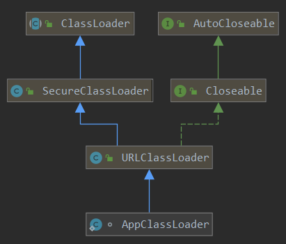
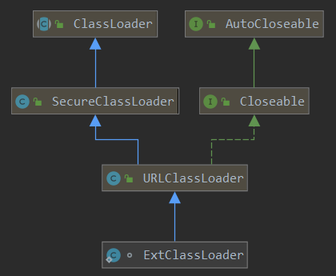
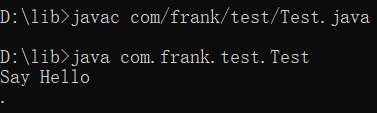
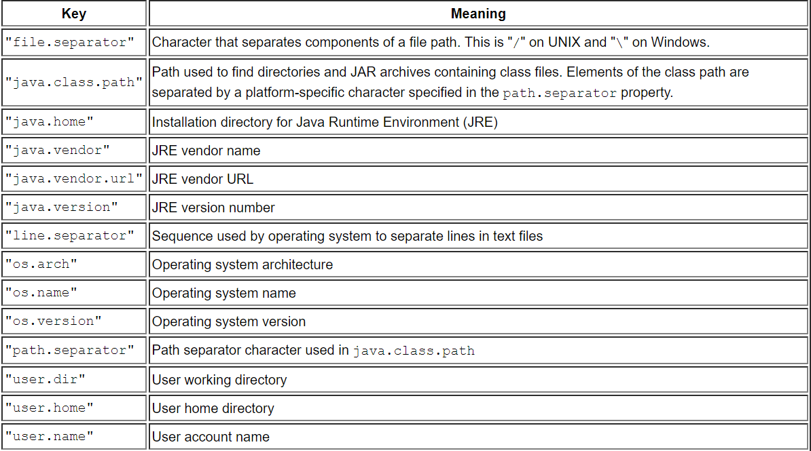

# 类加载机制

## 加载

1. 加载的过程虚拟机需要完成以下三个步骤：

    1. 通过``classpath``和类的全限定名（包名加类名）来获取定义此类的二进制字节流

        + 上述步骤1虚拟机规范并没有规定二进制字节流必须要从``*.class``文件中获取，即并没有指出从哪里获取，怎样获取。
        + 我们可以从``ZIP``包中读取，即从``JAR``包中获取。也可以从``*.class``文件中获取，也可以通过反射，动态获取。

    2. 将该字节流内容存入到**方法区**中。至于在方法区中以什么样的格式来进行存储，不同的虚拟机有不同的实现，虚拟机规范并没有规定具体的数据结构来存储二进制字节流。

    3. 在**内存**中生成一个代表这个类的``java.lang.Class``类的对象，作为方法区中这个类的**各种数据**的访问入口。即通过这个对象来访问方法区中关于这个类的各种数据。

        + ``java.lang.Class``类的实例对象虽然是一个对象，但是虚拟机规范并没有规定该对象要放在``Java``堆中，不同的虚拟机有不同的实现

        + ``HotSpot``虚拟机而言，**该对象存放在方法区中**。

2. 类加载器
    类加载器实现的功能是将类加载到``JVM``中。

    1. 类的唯一性
        对于任意一个类，都需要由加载它的类加载器和这个类本身一同确立其在``Java``虚拟机中的唯一性。即比较两个类是否**相等**，只有在这两个类是由同一个类加载器加载的前提下才有意义，否则，即使这两个类来源于同一个``*.class``文件，并且位于同一个虚拟机实例，只要加载它们的类加载器不同，那么这两个类必定不相等。

        + 相等：包括使用类的``Class``对象的``equals()``方法、``isAssignableFrom()``方法、``isInstance()``方法的返回结果，也包括使用``instanceof``关键字做对象所属关系判定等。

            ```java
            //TODO
            ```

        + 注意：在``IDEA``中，``classpath``被修改为``D:\GoogleDownload\ClassViewer_win521\StringLearn\out\production\StringLearn``。


    2. 双亲委派模型

        1. 从虚拟机的角度来看，只存在两种不同的类加载器：一种是启动类加载器（``Bootstrap ClassLoader``），这个类加载器是由``C++``语言实现，是虚拟机的一部分；另一种就是所有的其他的类加载器，这些类加载器都由``Java``语言实现，并且**全部继承自抽象类``java.lang.ClassLoader``**，即这些类加载器都是由``Java``语言写出来的类。其中``AppClassLoader``和``ExtClassLoader``类加载器的源码在``sun.misc.Launcher.java``文件中，``ExtClassLoader``和``AppClassLoader``都是``Launch``类的**静态内部类**。而``sun.misc.Launch.java``类的二进制字节码文件``sun.misc.Launch.class``是由``Bootstrap ClassLoader``类加载器来进行加载的。可以通过以下代码来进行验证：

            ```java
            //控制台打印输出为 null。说明Launcher是通过Bootstrap ClassLoader来进行加载的
            System.out.println(Launcher.class.getClassLoader());
            ```

            ```java
            /**
             * 1.Launcher类的构造方法中创建了Extension ClassLoader和Application ClassLoader
             *   类加载器实例
             * 2.Extension ClassLoader和Application ClassLoader都是Launch类的静态内部类
             */

            public Launcher() {
                // Create the extension class loader
                ClassLoader extcl;
                try {
                    //通过调用getExtClassLoader()静态方法来返回Extension ClassLoader类的实例
                    extcl = ExtClassLoader.getExtClassLoader();
                } catch (IOException e) {
                    throw new InternalError(
                            "Could not create extension class loader", e);
                }

                // Now create the class loader to use to launch the application
                try {
                    //通过调用getAppClassLoader(extcl)静态方法来创建AppClassLoader类的实例
                    //注意：该静态方法需要用ExtClassLoader类的实例作为其参数，赋值给内部的成员
                    //变量parent。
                    //从而说明Application ClassLoader的父加载器是ExtClassLoader。但是这种继承关系
                    //不是通过extends关键字来实现，而是通过组合的形式来实现继承的。
                    loader = AppClassLoader.getAppClassLoader(extcl);
                } catch (IOException e) {
                    throw new InternalError(
                            "Could not create application class loader", e);
                }

                // Also set the context class loader for the primordial thread.
                Thread.currentThread().setContextClassLoader(loader);

                // Finally, install a security manager if requested
                String s = System.getProperty("java.security.manager");
                if (s != null) {
                    SecurityManager sm = null;
                    if ("".equals(s) || "default".equals(s)) {
                        sm = new java.lang.SecurityManager();
                    } else {
                        try {
                            sm = (SecurityManager) loader.loadClass(s).newInstance();
                        } catch (IllegalAccessException e) {
                        } catch (InstantiationException e) {
                        } catch (ClassNotFoundException e) {
                        } catch (ClassCastException e) {
                        }
                    }
                    if (sm != null) {
                        System.setSecurityManager(sm);
                    } else {
                        throw new InternalError(
                                "Could not create SecurityManager: " + s);
                    }
                }
            }

            ```

            ``AppClassLoader``和``ExtClassLoader``继承关系如下：
                
                

        2. **每一个加载器类都有一个父加载器**

            + 每一个类加载器的父加载器的引用都保存在该类加载器的成员变量``parent``中。因为除了``Bootstrap ClassLoader``，所有的类加载器均继承（间接继承）自``ClassLoader`` ，即也继承了这个类的成员变量``parent``。

            + 对于自定义的类加载器，**所有的自定义类加载器必须继承自``java.lang.ClassLoader``**，由于子类初始化调用构造函数的时候，**会先调用父类的构造函数**，如果子类调用的是**父类的无参构造函数**（注意：在子类构造函数执行之前，会先执行父类的构造函数，然后执行父类的父类的构造函数，...一直往上直至执行完说有的父类的构造函数），即没有给``parent``变量显示赋值，那么会采用默认值``getSystemClassLoader()``，该函数内部实际上是新建一个``Launch``类实例，然后调用``Launch``类实例的``getClassLoader()``方法，返回的是``loader``。而``loader``在``Launch``类实例化时赋值为``AppClassLoader``。所以在默认的情况下，所有继承``ClassLoader``的类的``parent``属性的默认值为``AppClassLoader``类的实例，**即所有的自定义的类加载器的父加载器在默认的情况下是``AppClassLoader``**

            + 对于``AppClassLoader``，根据``Launch``类的源码看，其``parent``被赋值为``ExtClassLoader``类的实例。对于``ExtClassLoader``，其``parent``被赋值为``null``，本质上该父加载器为``Bootstrap ClassLoader``

            + 综上所述，除了``BootStrap ClassLoader``，所有的**类加载器都有一个父加载器**。

        3. 如何实现双亲委派机制

            实现双亲委派机制的代码如下：

            ```java
            protected Class<?> loadClass(String name, boolean resolve) throws ClassNotFoundException
            {
                synchronized (getClassLoadingLock(name)) {
                    // First, check if the class has already been loaded
                    //注意name是全限定名，即包名加类名，不加.class后缀
                    //首先先根据全限定名name判断该类是否已经加载
                    //此时注意判断类的唯一性，
                    Class<?> c = findLoadedClass(name);
                    if (c == null) {
                        long t0 = System.nanoTime();
                        try {
                            if (parent != null) {
                                c = parent.loadClass(name, false);
                            } else {
                                c = findBootstrapClassOrNull(name);
                            }
                        } catch (ClassNotFoundException e) {
                            // ClassNotFoundException thrown if class not found
                            // from the non-null parent class loader
                        }
                        if (c == null) {
                            // If still not found, then invoke findClass in order
                            // to find the class.
                            long t1 = System.nanoTime();
                            //如果父类类加载器加载失败，那么自己尝试加载
                            c = findClass(name);

                            // this is the defining class loader; record the stats
                            sun.misc.PerfCounter.getParentDelegationTime().addTime(t1 - t0);
                            sun.misc.PerfCounter.getFindClassTime().addElapsedTimeFrom(t1);
                            sun.misc.PerfCounter.getFindClasses().increment();
                        }
                    }
                    if (resolve) {
                        resolveClass(c);
                    }
                    return c;
                }
            }
            ```

            **说明**：
            + 首先，``JVM``通过上述方法来实现类的加载。如果不是显示的通过自己自定义的类加载器来加载类，那么``JVM``会默认调用``AppClassLoader``类加载器进行加载我们字节写的类。而``AppClassLoader``类加载器实现加载的方法``loadClass()``源码如下：

                ```java
                /**
                 * Override loadClass so we can checkPackageAccess.
                 */
                public Class<?> loadClass(String name, boolean resolve)
                        throws ClassNotFoundException {
                    int i = name.lastIndexOf('.');
                    if (i != -1) {
                        SecurityManager sm = System.getSecurityManager();
                        if (sm != null) {
                            sm.checkPackageAccess(name.substring(0, i));
                        }
                    }

                    if (ucp.knownToNotExist(name)) {
                        // The class of the given name is not found in the parent
                        // class loader as well as its local URLClassPath.
                        // Check if this class has already been defined dynamically;
                        // if so, return the loaded class; otherwise, skip the parent
                        // delegation and findClass.
                        Class<?> c = findLoadedClass(name);
                        if (c != null) {
                            if (resolve) {
                                resolveClass(c);
                            }
                            return c;
                        }
                        throw new ClassNotFoundException(name);
                    }
                    //这里还是调用父类类加载器的loadClass()方法进行类加载
                    //而并没有其他类重写了ClassLoader类的loadClass()方法
                    //所以本质上是调用从ClassLoader继承过来的loadClass()方法
                    //来进行类加载。
                    return (super.loadClass(name, resolve));
                }

                ```

            + ``ClassLoader``类的``loadClass()``方法源码如下：
                ~~**注意**：分析这个方法只要分析其实现逻辑即可，不要去分析其具体是怎么加载的。即``AppClassLoader``和``ExtClassLoader``和``Bootstrap ClassLoader``的``findClass``方法是本地方法，可能是其他什么语言实现，在源码中看不到，但是我们只要自己知道``findClass()``是实现去查找类然后加载到虚拟机即可~~。然后**当我们自定义类加载器时，便是要重写该方法**。``override findClass()``方法也**不会破坏双亲委派模型**。

            + ``ClassLoader``类的``loadClass()``方法仅仅抛出了一个异常，并没有进行实际的类加载的实现。注意``AppClassLoader``继承自``URLClassLoader``，而``URLClassLoader``重写了``ClassLoader``类中的``loadClass()``方法，这个实际上是真正执行加载操作。``AppClassLoader``类也重写了``loadClass()``方法，但仅仅是额外增加了一些权限检查操作。最后还是调用``super.loadClass(name, resolve)``，即``URLClassLoader``类中的``loadClass()``方法。而该方法并没有被``URLClassLoader``和``SecurityClassLoader``重写，所以还是调用``ClassLoader``类中的``loadClass()``方法。**但是，此时loadClass()方法里调用的findClass()方法是``URLClassLoader``类``Override ClassLoader``类的方法，而正是这个方法真正实现了加载类的操作**。``URLClassLoader``类实现的``findClass()``方法源码如下：

                ```java

                /**
                 * 进行具体的类加载操作
                 */
                protected Class<?> findClass(final String name) throws ClassNotFoundException
                {
                    final Class<?> result;
                    try {
                        result = AccessController.doPrivileged(
                            new PrivilegedExceptionAction<Class<?>>() {
                                public Class<?> run() throws ClassNotFoundException {
                                    String path = name.replace('.', '/').concat(".class");
                                    Resource res = ucp.getResource(path, false);
                                    if (res != null) {
                                        try {
                                            return defineClass(name, res);
                                        } catch (IOException e) {
                                            throw new ClassNotFoundException(name, e);
                                        }
                                    } else {
                                        return null;
                                    }
                                }
                            }, acc);
                    } catch (java.security.PrivilegedActionException pae) {
                        throw (ClassNotFoundException) pae.getException();
                    }
                    if (result == null) {
                        throw new ClassNotFoundException(name);
                    }
                    return result;
                }

                ```

            + 不同的类加载器加载类的路径

                + ``Bootstrap ClassLoader``，负责加载``jre\lib``下的类库，或者``-Xbootclasspath``参数所指定的路径中的类库。并且这些类库的文件名需要被虚拟机识别，如``rt.jar``（名字不被识别的类库即使放在``lib``目录下也不会被加载）

                    ```java
                    System.out.println(System.getProperty("sun.boot.class.path"));
                    /**
                     * D:\JavaJDK\jre\lib\resources.jar;
                     * D:\JavaJDK\jre\lib\rt.jar;
                     * D:\JavaJDK\jre\lib\sunrsasign.jar;
                     * D:\JavaJDK\jre\lib\jsse.jar;
                     * D:\JavaJDK\jre\lib\jce.jar;
                     * D:\JavaJDK\jre\lib\charsets.jar;
                     * D:\JavaJDK\jre\lib\jfr.jar;
                     * D:\JavaJDK\jre\classes
                     */
                    ```

                + ``ExtClassLoader``，负责加载``jre\lib\ext``下的类库，或者``java.ext.dirs``系统变量指定的路径中的类库。

                    ```java
                    //TODO


                    ```

                + ``AppClassLoader``，负责加载``classpath``路径下的类

            + 实现自己自定义类加载器

                不管是``Bootstrap ClassLoader``还是``ExtClassLoader``或者``AppClassLoader``，这些类加载器都只是加载指定的目录下的``jar``包或者字节码文件等。如果在某种情况下，我们需要动态加载一些东西呢？比如从``D``盘某个文件夹加载一个``class``文件，或者从网络上下载``class``主内容然后再进行加载，那么就需要自定义一个``ClassLoader``

                **步骤**：
                1. 编写一个类继承``extends``自``ClassLoader``类，因为所有的自定义类加载器必须继承自``ClassLoader``
                2. ``override``它的``findClass()``方法，即加上我们自己的业务逻辑，将某处的二进制字节码转换成字节数组。由于仅仅``override findClass()``方法，所以不会破坏双亲委派机制。
                3. 在``findClass()``方法中调用``defineClass()``，将上述步骤得到的**字节数组**作为该函数的参数，然后将该字节数组转变成``Class<?>``，然后将函数返回值``Class<?>``返回，即``defineClass()``函数的返回值``Class<?>``

                **注意事项**：

                1. 自定义的``ClassLoader``创建时如果没有指定``parent``，那么它的``parent``默认就是``AppClassLoader``。如果需要指定``parent``，那么通过``super(parent)``方法来指定该类加载器的``parent``。

                2. 注意一定要明确仅仅``override ClassLoader``类的``findClass()``方法。**最好**不要``override``其``loadClass()``方法，否则会破坏双亲委派机制。

                    ```java
                    import java.io.ByteArrayOutputStream;
                    import java.io.File;
                    import java.io.FileInputStream;
                    import java.io.IOException;

                    public class DiskClassLoader extends ClassLoader {

                        private String mLibPath;

                        public DiskClassLoader(String path) {
                            mLibPath = path;
                        }

                        @Override
                        protected Class<?> findClass(String name) throws ClassNotFoundException {

                            //注意：传入给findClass(name)函数的name必须是一个类的全限定名即包名加上类名
                            //且传入的是class文件，而不是类的源文件。并且全限定名不包括后缀的.class
                            //即com.bupt.caobo.Test这个是全限定名。
                            //需要将name中的包名去掉，得到Test，然后加上.class后缀，即Test.class才可以通过IO流进行读取
                            //这个字节码文件
                            String fileName = getFileName(name);
                            File file = new File(mLibPath, fileName);
                            try {
                                FileInputStream is = new FileInputStream(file);
                                ByteArrayOutputStream bos = new ByteArrayOutputStream();
                                int len = 0;
                                while ((len = is.read()) != -1) {
                                    bos.write(len);
                                }
                                byte[] data = bos.toByteArray();
                                is.close();
                                bos.close();
                                //只要返回一个Class对象即可
                                return defineClass(name, data, 0, data.length);
                            } catch (IOException e) {
                                e.printStackTrace();
                            }
                            //TODO 本质上还是调用ClassLoader的findClass(name)方法？？？
                            //TODO 注意此时super是ClassLoader，而不是AppClassLoader。
                            //前者是extends继承的父类，后者是parent的父类加载器
                            //所以这是调用ClassLoader的findClass()方法，本质上啥也没做。
                            return super.findClass(name);
                        }

                        private String getFileName(String name) {
                            int index = name.lastIndexOf('.');
                            if (index == -1) {
                                //传入的是全限定名，包名加类名
                                return name + ".class";
                            } else {
                                return name.substring(index + 1) + ".class";
                            }
                        }
                    }

                    import java.lang.reflect.InvocationTargetException;
                    import java.lang.reflect.Method;

                    public class ClassLoaderTest {
                        public static void main(String[] args) {
                            //对于目录，是否应该养成一个习惯，用File.separator来进行结尾
                            DiskClassLoader diskClassLoader = new DiskClassLoader("D:"+ File.separator+ "lib" + File.separator);
                            try {
                                Class<?> c = diskClassLoader.loadClass("com.frank.test.Test");
                                if (c != null) {
                                    try {
                                        Object obj = c.newInstance();
                                        Method method = c.getDeclaredMethod("say", null);
                                        method.invoke(obj, null);  // 输出 Say Hello
                                    } catch (IllegalAccessException | InstantiationException | NoSuchMethodException | InvocationTargetException e) {
                                        e.printStackTrace();
                                    }
                                }
                            } catch (ClassNotFoundException e) {
                                e.printStackTrace();
                            }
                        }
                    }
                    ```

                3. 通过自定义``ClassLoader``，这样我们就自定义我们需要加载的字节码文件的位置。从而不需要设置``classpath``。对于``classpath``，如果我们没有设置的话，那么默认的``classpath``是当前目录（当该``*.class``文件不在某个包下，此时运行的``*.class``文件所在的目录）。即通过``System.getProperty("java.class.path")``来进行查询得到的返回值为 . ，而 . 代表着当前目录。对于有包名，参考如下：

                    ```java
                    package com.frank.test;

                    public class Test{

                        public void say(){
                            System.out.println("Say Hello");
                        }
                        public static void main(String[] args){
                            Test test = new Test();
                            test.say();
                            //输出为执行java命令所在的目录，而不是clas文件所在的目录

                            //注意编译和运行的写法。如果某个类位于某个包下，那么一定创建了
                            //所有的包名文件夹
                            System.out.println(System.getProperty("java.class.path"));
                        }
                    }
                    ```

                    

                    
                    ``System.out.println(System.getProperty("user.dir"));``在``IDEA``中得到的是项目所在的目录（该目录下是``.idea``，``src``等文件夹）。而普通的目录下，得到的是该``Java``文件所在的目录全名。

                4. 定义自己的加密解密协议

                    ```java
                    // TODO
                    ```

    3. 线程上下文加载器``Context ClassLoader``

        区分：``Bootstrap ClassLoader``和``ExtClassLoader``和``AppClassLoader``是真实存在的类，即有对应的``Java``类源码。并且遵循双亲委派机制。而``ContextClassLoader``仅仅是一个概念。通过查看``Thread``源码可知``contextClassLoader``仅仅是一个成员变量，可以通过``setContextClassLoader``和``getContextClassLoader()``来进行对其设置和获取操作。
        每一个``Thread``都有一个与之相关联的的``ClassLoader``，默认为``AppClassLoader``。并且子线程默认使用父线程的``ClassLoader``，除非子线程经过特别设置。

        ```java
        public class Thread implements Runnable {
            // ...
            private ClassLoader contextClassLoader;
            public void setContextClassLoader(ClassLoader cl) {
                SecurityManager sm = System.getSecurityManager();
                if (sm != null) {
                    sm.checkPermission(new RuntimePermission("setContextClassLoader"));
                }
                contextClassLoader = cl;
            }


            public ClassLoader getContextClassLoader() {
                if (contextClassLoader == null)
                    return null;
                SecurityManager sm = System.getSecurityManager();
                if (sm != null) {
                    ClassLoader.checkClassLoaderPermission(contextClassLoader,
                            Reflection.getCallerClass());
                }
                return contextClassLoader;
            }
        }

        ```

        + 实际运用
