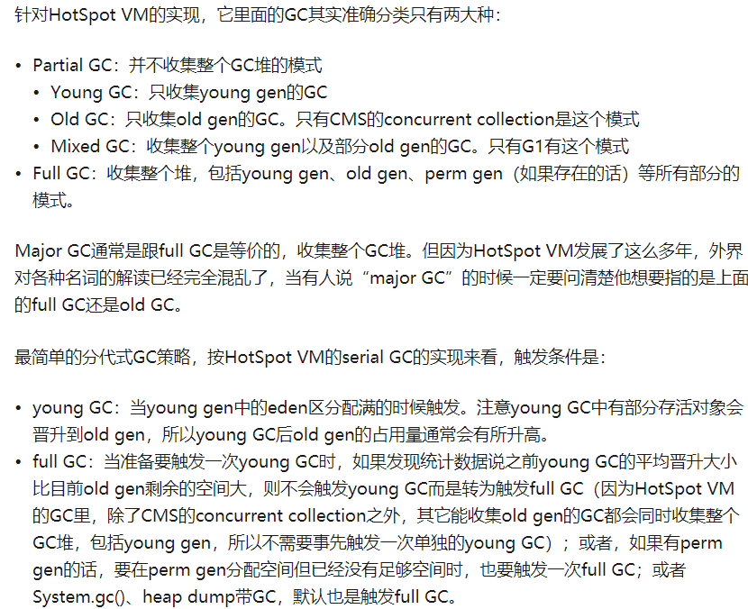
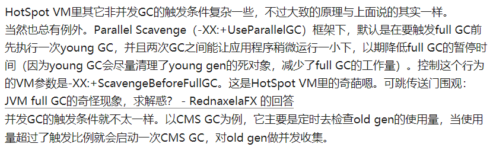

# 对象分配

## 对象的分配原则

对象一般分配在堆上，但是这个结论不那么准确，因为对象也可以在栈上分配。

1. 大多数情况下，对象优先在新生代的``Eden``区分配。当``Eden``区没有足够的空间进行分配时，虚拟机会对新生代执行一次``Minor GC``，将存活下来的对象转移到``Survivor``。如果此时转移失败，即``Survivor``区没有足够的空间来存放这些对象，那么会通过


2. 逃逸分析**见深入理解java虚拟机课本**
逃逸分析的本质行为是分析对象动态作用域。当一个对象在方法中被定义后，它可能被外部方法所引用，例如作为调用参数传递到其他方法中，称为方法逃逸；对象也有可能被其他线程访问到，如复制给类变量或者可以在其他线程中访问的实例变量，称为线程逃逸。

    ```java
    public class EscapeAnalysis {

        //下面两个实例变量由于别的线程也有可能访问到。所以会发生线程逃逸。
        public static Object object;
        public Object obj;

        public void globalVariableEscape(){//全局变量赋值逃逸
            object =new Object();
        }

        public Object methodEscape(){  //方法返回值逃逸
            return new Object();
        }

        public StriingBuilder instancePassEscape(){
            sb.append("name");
            return sb; //发生了方法返回值逃逸
        }

        public void speak(EscapeAnalysis escapeAnalysis){
            return new Object(); // 实例变量发生逃逸
        }

        public String createString(String ... values){
            StringBuffer stringBuffer = new StringBuffer();
            for (String string : values) {
                stringBuffer.append(string+",");
            }
            return stringBuffer.toString();  // 从而stringBuilder不会发生逃逸
        }
    }

    ```

**分配策略**：

如果``JVM``启动了逃逸分析，那么new一个对象时，首先会尝试在栈上分配，如果分配不了，则会尝试在线程本地分配，如果栈上分配与线程本地分配均分配失败的话，则会先判断该对象是否为大对象，如果是大对象，则在老年代分配内存，否则到新生代的``eden``区分配。如果一个对象不会逃逸到方法或者线程之外，则可以对这个对象进行一些高效的优化：

```java

-XX:+DoEscapeAnalysis -XX:+EliminateAllocations -XX:+UseTLAB

```

```java
public String createString(String ... values){
    StringBuffer stringBuffer = new StringBuffer();
    for (String string : values) {
        stringBuffer.append(string+" ");
    }
    //本来StringBuffer的append()方法是会进行加锁操作的
    //但是经过逃逸分析，发现StringBuilder这个变量不会逃逸到方法之外，即不会有其他的线程
    //通过调用同一个StringBuffer变量来执行append()操作。所以
    //直接会进行同步消除操作，提高效率
    return stringBuffer.toString();
}

public static void main(String[] args) {
    long start = System.currentTimeMillis();
    EscapeAnalysis escapeAnalysis = new EscapeAnalysis();
    for (int i = 0; i < 1000000; i++) {
        escapeAnalysis.createString("Escape", "Hello");
    }
    long bufferCost = System.currentTimeMillis() - start;
    System.out.println("craeteString: " + bufferCost + " ms");
}
```

```java
public static void main(String[] args) {
   alloc();
}

private static void alloc() {
   Point point = new Point（1,2）;
   System.out.println("point.x="+point.x+"; point.y="+point.y);
}
class Point{
    private int x;
    private int y;
}
//Point对象由于没有逃逸到方法之外，所以可以被标量替换

private static void alloc() {
   int x = 1;
   int y = 2;
   System.out.println("point.x="+x+"; point.y="+y);
}
```




1. Full GC定义是相对明确的，就是针对整个新生代、老生代、元空间（metaspace，java8以上版本取代perm gen）的全局范围的GC