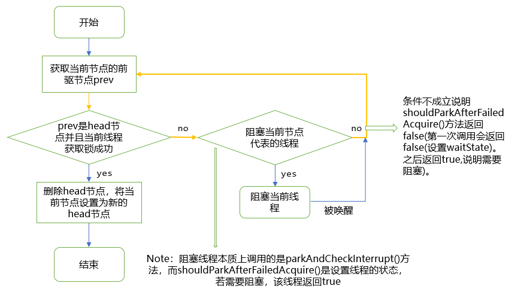

[toc]

# AQS

## ``state``

即抽象队列同步器，首先，``AQS``类中维护了一个``state``字段，并且该字段由``volatile``修饰，它就是所谓的同步状态。由于被``volatile``修饰，所以任何线程对其进行修改对于其他线程都是立即可见的 。

```java
private volatile int state;
```

``AQS``类提供了访问这个字段的方法

```java
protected final int getState();  // 获取此时state的值
protected final void setState(int newState);  // 设置state的值
/*
使用CAS方式更新state的值，成功返回true,否则返回false
 */
protected final boolean compareAndSetState(int expect, int update);
```

**说明**：

1. 这些方法都是``final``修饰的，说明子类无法重写他们。
2. 独占模式 ``Exclusive Mode``与共享模式``Shared Mode``。
3. 在独占模式下，一个线程在执行某些操作的时候，其他线程不可以执行这些操作。比如持有独占锁的操作，一个线程持有了独占锁，那么其他线程不能持有锁。而共享模式允许多个线程同时进行某种操作。在独占模式下，我们可以把``state``字段的初始值设置为0，每当某个线程要进行某项操作**之前**，都需要判断``state``的值是不是0，如果不是0的话意味着别的线程已经进入该操作，那么本线程需要等待，如果是0的话就把``state``字段的值原子性设置为1。自己进入该操作。这个先判断为0然后设置为1的过程可以通过``CAS``操作来保证原子性。在共享模式下，比如我们把某项操作设置为最多允许10个线程同时进行。那么我们就可以把``state``的初始值设置为10，一个线程尝试获取锁成功，那么减1，直到``state``减为0，此时不能有线程继续执行这项操作，除非之前的线程释放了该操作。

## 同步队列

同步队列是一个双向队列（即组成队列的每一个节点都有一个``prev``和``next``属性，分别指向前一个节点和后一个节点），且满足``FIFO``。``AQS``类中有``tail``和``head``两个属性，分别指向该同步队列的队首和队尾。

这个队列的节点类被定义成了一个静态的内部类，主要字段如下：

```java
static final class Node {
    volatile int waitStatus;  // 初始值为0
    volatile Node prev;  // 指向该节点的前驱节点，队首节点无前驱节点，此时prev为null
    volatile Node next;  // 指向该节点的后继节点，队尾节点没后继节点，此时next为null
    volatile Thread thread;  // 每一个等待的线程都被包装成一个节点，thread指向该节点对应的线程
    Node nextWaiter;

    static final int CANCELLED =  1;
    static final int SIGNAL    = -1;
    static final int CONDITION = -2;
    static final int PROPAGATE = -3;
}
```

|静态变量|值|描述|
|:-:|:-:|:-:|
|``Node.CANCELLED``|1|**当前节点**对应的线程已经被取消|
|``Node.SIGNAL``|-1|表示当前节点的后继节点被阻塞，当前节点对应的线程在释放或者取消时，要将后续节点解除阻塞|
|``Node.CONDITION``|-2|表示**当前节点**在等待队列中|
|``Node.PROPAGATE``|-3||
|无|0|初始状态|

1. 独占状态下同步状态的获取与释放

    在**独占模式**下，任何一个时刻都只能有一个线程获取到同步状态，其他同时去获取同步状态的线程都会被包装成一个``Node``节点放入到同步队列中，直到获取到同步状态的线程释放掉同步状态。
    

    说明：
    + ``waitStatus``：表示节点所代表的线程在同步队列中的状态
    + ``prev``：该变量类型为``Node``类型，指向当前节点的前一个``Node``节点（前驱）
    + ``next``：该变量类型为``Node``类型，指向当前节点的后一个``Node``节点（后继）
    + 该变量类型为``Thread``，指向该节点所代表的线程
    + ``nextWaiter``：该变量类型为``Node``类型，指向下一个等待的节点

2. 实现插入等待队列

    + ``addWaiter()``函数
    对于获取锁失败的线程，通过该函数将其放入到同步队列中等待获取锁

    + ``acquireQueued()``
    对已经在排队的线程进行获取锁的操作，源码如下：

        ```java
        final boolean acquireQueued(final Node node, int arg) {
            boolean failed = true;
            try {
                boolean interrupted = false;
                for (; ;) {
                    final Node p = node.predecessor();
                    if (p == head && tryAcquire(arg)) {
                        setHead(node);
                        p.next = null; // help GC
                        failed = false;
                        return interrupted;
                    }
                    /*
                    获取不到锁，那么直接阻塞，阻塞结束仍执行循环，尝试获取锁
                     */
                    if (shouldParkAfterFailedAcquire(p, node) && parkAndCheckInterrupt())
                        interrupted = true;
                }
            } finally {
                if (failed)
                    cancelAcquire(node);
            }
        }
        ```

        函数流程如下：
        

        流程图补充说明：黄色箭头所在的流程是一个``for(;;)``循环。而跳出该循环的唯一条件是``prev``节点是``head``节点，并且当前线程获取锁成功。

    + ``shouldParkAfterFailedAcquire()``和``parkAndCheckInterrupt()``
    作用：设置``waitState``和阻塞当前线程
    如果当前节点的``prev``不是头节点或者获取锁失败，那么会先执行``shouldParkAfterFailedAcquire()``方法。该方法流程图如下：
    
    第一次执行该方法设置完``waitState``后，会返回``false``。即``if (shouldParkAfterFailedAcquire(p, node) &&parkAndCheckInterrupt())``条件不成立，再次进行``for(;;)``循环，第二次执行到该方法，该函数返回``true``，然后执行``parkAndCheckInterrupt()``方法将线程阻塞。当线程被唤醒时，再次进行``for(; ;)``循环尝试获取锁的操作。如果获取锁失败，再次阻塞。

    **总结**：一个线程如果获取锁失败了，那么就通过``addWaiter()``方法放到同步队列中等待，而``acquireQueued()``方法就是把放入队列中的这个线程不断进行获取锁操作，直到它**成功获取锁**。

---

## 公平锁与非公平锁

不管是在公平锁还是非公平锁的模式下，``ReentrantLock``或者其他锁实现对于同步队列中的线程都能**保证排在队列前面的线程一定比排在队列后面的线程优先获取到锁**。但是非公平锁模式下不保证**队列中的第一个线程就一定比先来的线程（此时还未加入到同步队列）优先获取到锁**。因为队列中的第一个线程尝试获取锁时，可能刚好来了一个线程尝试获取锁，并且成功获取到了锁。
对于``ReentrantLock``，提供给外部的加锁的源码如下：

```java
public void lock() {
    sync.lock();  // 根据sync具体指向的实例对象从而执行不同的lock()方法
}
```

根据``ReentrantLock``调用构造函数实例化对象时创建的是公平锁还是非公平锁，``sync``指向的具体实例对象不同。如果是公平锁，那么``sync``类型是``FairSync``。如果是非公平锁，那么``sync``类型是``NonfairSync``。``FairSync``和``NonfairSync``均是``ReentrantLock``类的内部类。且``FairSync``和``NonfairSync``均继承自``Sync``。而``Sync``也是``ReentrantLock``类的抽象内部类，且继承``AQS``

```java
abstract static class Sync extends AbstractQueuedSynchronizer{...}  // 抽象内部类Sync继承AQS
static final class NonfairSync extends Sync{...}  // NonfairSync继承Sync
static final class FairSync extends Sync{...}  // FairSync继承Sync

public ReentrantLock() {
    sync = new NonfairSync();  // 默认是非公平锁
}

public ReentrantLock(boolean fair) {
    sync = fair ? new FairSync() : new NonfairSync();  // 根据传入的fair来实现创建公平锁或者非公平锁
}

/*
不论是公平锁还是非公平锁，释放锁的代码都是一样的。注意：int release传入的值为1
*/
public void unlock() {
    sync.release(1);  // releases值为1
}

protected final boolean tryRelease(int releases) {
    int c = getState() - releases;  // 将同步状态自减1，因为releases传入的值在源代码中默认为1
    if (Thread.currentThread() != getExclusiveOwnerThread())
        throw new IllegalMonitorStateException();
    boolean free = false;
    if (c == 0) {
        free = true;
        setExclusiveOwnerThread(null);
    }
    /*
    1.当将同步状态减1之后，发现state的值不为0，那么说明锁进行了重入
    所以将state设置为 c ，然后返回false。说明释放锁失败
    2.注意：对于重入锁，调用几次lock()函数进行加锁操作，就要调用几次unlock()函数
    进行释放锁的操作
    */
    setState(c);
    return free;  // 当为重入的情况下。返回free的默认值false
}

/*
判断锁是否能被线程独占。因为是可重入锁，所以不能通过state的状态来判断
是否被线程独占。但是如果是非重入锁，那么可以通过state状态来进行判断。参考
Mutex类的实现
*/
protected final boolean isHeldExclusively() {
    // While we must in general read state before owner,
    // we don't need to do so to check if current thread is owner
    return getExclusiveOwnerThread() == Thread.currentThread();
    //State的值
}

final void lock() {
    acquire(1);  // 传入的acquire参数值为1
}

protected final boolean tryAcquire(int acquires) {
    final Thread current = Thread.currentThread();
    int c = getState(); //因为state是用volatile修饰的，所以此处得到的肯定是一个最新的状态值
    if (c == 0) {  // 如果锁没有被获取
        /*
        对于公平锁，首先先判断是否有线程在同步队列里等待，如果有，那么直接获取锁失败，返回false。
        */
        if (!hasQueuedPredecessors() && compareAndSetState(0, acquires)) {
            setExclusiveOwnerThread(current);
            return true; //在这里返回true，说明成功获取到了同步状态
        }
    }
    //如果锁已经被获取，那么若此时已经获取锁的线程即是当前线程，那么直接获取锁并将state字段的值加1
    else if (current == getExclusiveOwnerThread()) {
        int nextc = c + acquires; //一个线程多次获取到锁，即实现了锁的重入操作
        if (nextc < 0)
            throw new Error("Maximum lock count exceeded");
        setState(nextc);
        return true;
    }
    return false;
}

final void lock() {
    /*
    非公平锁lock()会直接通过原子性的操作尝试获取锁，获取到了，那么就直接执行获取锁后的逻辑代码。
    如果失败，那么执行acquire()尝试获取锁。
    */
    if (compareAndSetState(0, 1))
        setExclusiveOwnerThread(Thread.currentThread()); //一个原子性的操作设置此时线程。
    else
        acquire(1); // acquire()会调用自己覆写的tryAcquire()
}

protected final boolean tryAcquire(int acquires) {
    /*
    而非公平锁tryAcquire()本质上是调用Sync类中的方法nonfairTryAcquire()，而NonfairSync继承自Sync
    */
    return nonfairTryAcquire(acquires);
}

final boolean nonfairTryAcquire(int acquires) {
    final Thread current = Thread.currentThread();
    int c = getState();
    if (c == 0) {
        /*
        注意与公平锁的if(!hasQueuedPredecessors() && compareAndSetState(0, acquires))的区别：
        前者仅仅多了一个hasQueuedPredecessors()方法判断当前同步队列是否有等待线程。即公平锁尽管
        此时没有线程占据锁，也会在获取锁之前判断当前同步队列里有没有线程等待获取锁，如果有，那么
        当前线程阻塞。而非公平锁直接尝试原子性获取锁。不管当前同步队列有没有线程等待获取锁
        */
        if (compareAndSetState(0, acquires)) {
            setExclusiveOwnerThread(current);
            return true;
        }
    }
    else if (current == getExclusiveOwnerThread()) {
        //如果锁已经被获取，那么判断是否可重入
        int nextc = c + acquires;
        if (nextc < 0) // overflow
            throw new Error("Maximum lock count exceeded");
        setState(nextc);
        return true;
    }
    return false;
}

```

---

## ``await/signal``等待唤醒机制

为了实现等待唤醒机制，``AQS``类中有一个内部类，``ConditionObject``，而这个类实现了``Condition``接口，具体源码如下所示：

```java
public abstract class AbstractQueuedSynchronizer {
    /*
    由于ConditionObject是AQS的成员内部类，所以ConditionObject实例对象里存放
    了一个指向外部类AQS的引用。所以可以通过ConditionObject来访问到同步队列
     */

    public class ConditionObject implements Condition, java.io.Serializable {
        /*
        内部有两个Node类型的成员变量，分别指向等待队列的头节点和尾节点
         */
        private transient Node firstWaiter;
        private transient Node lastWaiter;

        // ...
    }
}

public class ReentrantLock implements Lock {

    private final Sync sync;

    abstract static class Sync extends AbstractQueuedSynchronizer {

        //ReentrantLock中的Sync实现的方法
        final ConditionObject newCondition() {
            return new ConditionObject();
        }
        // ...
    }

    //提供给外部接口的方法。本质上是调用Sync中的newCondition方法，从而创建了一个ConditionObject对象
    public Condition newCondition() {
        return sync.newCondition();
    }

    // ...
}
```

```java
public interface Condition {
    void await() throws InterruptedException;

    long awaitNanos(long nanosTimeout) throws InterruptedException;

    boolean await(long time, TimeUnit unit) throws InterruptedException;

    boolean awaitUntil(Date deadline) throws InterruptedException;

    void awaitUninterruptibly();

    void signal();

    void signalAll();
}
```

1. ``await()``方法

    + 在``condition``等待队列中创建一个``Node``节点，而这个节点跟之前同步队列中的节点是同一样的。

    + 执行流程：
        + 刚开始假设有3个线程``main``,``t1``,``t2``同时调用``ReentrantLock``对象的``lock()``方法去竞争锁，并且``main``线程竞争到了锁，那么会把线程``t1``和线程``t2``包装成``Node``节点插入到同步队列，所以``ReentrantLock``对象，``AQS``对象和同步队列的示意图如下所示：
        

        + 此时``main``线程获取到了锁处于运行的状态，但是运行时发现某个条件不满足，所以选择执行以下代码进入到``condition1``等待队列：

            ```java
            lock.lock();
            try{
                condition1.await();
            }finally{
                lock.unlock();
            }
            ```

            ``await()``方法主要做了以下几个事情：

            1. 创建一个``Node``节点，这个节点的``thread``值就是``main``线程，并且此时``waitStatus``为-2。如下所示：

                

            2. 将该节点插入到``condition1``等待队列中
                

            3. 因为此时``main``线程还持有锁，所以在释放锁之后唤醒同步队列中等待时间最长的线程，即线程``t1``。该线程会尝试获取锁。如果获取锁成功，那么会将节点0删除，节点1变成
            ``head``节点，且节点1此时的``thread``字段设置为``null``。此时等待队列如下：
                

        至此，``main``线程等待操作完成。假如获取到锁的``t1``线程此时也执行以下代码

        ```java
            lock.lock();
            try{
                condition1.await();
            }finally{
                lock.unlock();
            }
        ```

        那么还是会执行上面的过程。将``t1``包装成``Node``节点插入到``condition1``等待队列中去。如下：

        

        **注意**：同步队列是一个双向列表，``prev``指向前驱节点，``next``指向后继节点。而等待队列是一个单向列表。使用``nextWaiter``指向下一个等待的节点。

2. ``signal``方法

    + ``signal()``方法会将等待队列中的线程唤醒

        ```java
        lock.lock();
        try {
            contition2.signal();
        } finally {
            lock.unlock();
        }
        ```

3. 总结：

    + 内置锁即``synchronized``只能对应于一个等待队列，而``ReentrantLock``可以产生若干个等待队列，只需要调用``lock.newCondition()``方法即可。我们可以根据线程的不同等待条件（即在哪个``condition``对象上等待）来把线程放到不同的等待队列中。

    + 每一个显示锁对象可以产生若干个``Condition``对象，每一个``Condition``对象都会对应一个等待队列。即一个显示锁可以对应多个等待队列。

---

## 实现自己的同步器

**注意**：``override``以下几个方法

```java
protected boolean tryAcquire(int arg);  // ReentrantLock中arg为1
protected boolean tryRelease(int arg);  // ReentrantLock中arg为1
protected int tryAcquireShared(int arg);
protected boolean tryReleaseShared(int arg);
protected boolean isHeldExclusively();
```

```java

/*
1.该锁是一个很简单的独占锁，仅仅提供了加锁和释放锁操作
2.由于是独占锁，所以仅仅override：
    tryAcquire()
    tryRelease()
    isHeldExclusively()
3.由于没有实现Lock()接口，所以不需要实现该接口的6个抽象方法
*/
import java.util.concurrent.locks.AbstractQueuedSynchronizer;

public class MutexLock {
    private static class Sync extends AbstractQueuedSynchronizer {

        @Override
        protected boolean tryAcquire(int arg) {
            return compareAndSetState(0, 1);
            /*
            原子性更新同步状态，如果更新成功，那么即说明获取到了锁
            */
        }

        @Override
        protected boolean tryRelease(int arg) {
            //并没有进行IllegalMonitorStateException异常检测
            setState(0);  // 直接将State设置为0。
            return true;
        }

        @Override
        protected boolean isHeldExclusively() {
            return getState() == 1;
        }
    }

    private Sync sync = new Sync();

    /*
    1.由于不是实现的Lock接口，所以该加锁方法的方法名可以为其他任意的名字
    2.但是为了方便识别，建议用lock作为加锁方法的名字。
    3.不管怎样，加锁方法调用的是acquire()方法（该方法具体实现了将等待线程加入到同步队列）
    */

    public void lock() {
        sync.acquire(1);  // 注意：调用的是acquire方法。
    }

    public void unlock() {
        sync.release(1);  // 该方法提供了将同步队列的线程唤醒的操作
    }
}


/*
JDK文档中实现的Mutex
 */
import java.util.concurrent.TimeUnit;
import java.util.concurrent.locks.AbstractQueuedSynchronizer;
import java.util.concurrent.locks.Condition;
import java.util.concurrent.locks.Lock;

/*
* Here is a non-reentrant mutual exclusion lock class that uses
the value zero to represent the unlocked state, and one to
represent the locked state. While a non-reentrant lock does not
strictly require recording of the current owner thread, this
class does so anyway to make usage easier to monitor. It also
supports conditions and exposes one of the instrumentation
methods:
* */

//TODO 背诵该程序
/*
实现Lock接口说明要实现该接口的6个抽象方法
lock()
lockInterruptibly()
tryLock()
tryLock(Long time, TimeUnit unit)
unlock()
newCondition()  // 返回一个Condition对象。注意：Condition是一个接口
*/
public class Mutex implements Lock {

    //定义静态内部类，且该类继承自AQS。主要是为了重写5个方法
    /*
    tryAcquire()
    tryRelease()
    tryAcquireShared()
    tryReleaseShared()
    isHeldExclusively()
    */
    private static class Sync extends AbstractQueuedSynchronizer {

        @Override
        protected boolean isHeldExclusively() {
            /*
            在锁是非重入锁的情况下可以这样来判断锁是否已经被别的线程获取。
            在重入锁的情况下不能这样判断。注意参考reentrantLock的源码实现
            */
            return getState() == 1;
        }

        @Override
        protected boolean tryAcquire(int arg) {
            assert arg == 1;

            /*
            注意：该线程是非公平锁。即线程来了直接去尝试获取锁，获取失败则
            加入到同步队列中。而不是先查看当前同步队列有没有线程在等待。
            */

            if (compareAndSetState(0, 1)) {
                setExclusiveOwnerThread(Thread.currentThread());
                return true;
            }
            return false;
        }

        @Override
        protected boolean tryRelease(int arg) {
            assert arg == 1;
            if (getState() == 0) {
                throw new IllegalMonitorStateException();
            }
            setExclusiveOwnerThread(null);  //该方法返回的是当前线程
            setState(0);  // 直接设置为0即可
            return true;
        }

        Condition newCondition() {
            /*
            注意该方法在AQS抽象类中是不存在的。我们可以在AQS子类中
            子类中添加该方法，并且该方法返回的是一个ConditionObject对象
            因为子类继承AQS，所以也就继承了其内部类ConditionObject。
            而该方法便返回ConditionObject对象，而ConditionObject继承Object
            */
            return new ConditionObject();

        }
    }

    private final Sync sync = new Sync();  // 实例化该内部类对象出来

    @Override
    public void lock() {
        /*
        因为如果获取锁失败，那么会将其放入到同步队列中。所以要调用acquire()方法。
        acquire方法内部调用了tryAcquire()方法。而tryAcquire是我们自己override。
        */
        sync.acquire(1);
    }

    @Override
    public boolean tryLock() {
        /*
        尝试获取锁，如果获取到了，那么直接执行获取锁成功的代码，如果获取锁失败，
        那么直接返回，不会进行阻塞操作，也不会进行自旋操作。所以调用的是我们override
        的tryAcquire(1)方法。而不是AQS中的acquire()方法
        */
        return sync.tryAcquire(1);
    }

    @Override
    public void unlock() {
        sync.release(1);  // 因为要将阻塞的线程进行唤醒，所以要调用release。
    }

    @Override
    public void lockInterruptibly() throws InterruptedException {
        sync.acquireInterruptibly(1);  // 直接调用
    }

    @Override
    public boolean tryLock(long time, TimeUnit unit) throws InterruptedException {
        return sync.tryAcquireNanos(1, unit.toNanos(time));
    }

    public Condition newCondition() {
        return sync.newCondition();  // 对外提供的方法，用来创建Condition对象，从而实现等待唤醒机制
    }

    public boolean isLocked() {
        return sync.isHeldExclusively();
    }
}


//TODO 共享锁的实现有问题。发生了死锁的现象
import java.util.concurrent.locks.AbstractQueuedSynchronizer;
public class ShareLock{
    private static class Sync extends AbstractQueuedSynchronizer{}
    public Sync(){
        super();  // 注意，父类构造器是一个空的构造器
        setState(2);  // 设置能被两个线程获取锁
    }
}
```

