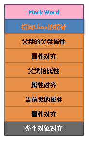

# ``Java``基础

1. 变量
    
    1. 成员变量是在类中定义的变量。而局部变量可以是在方法中定义的变量，也可以是在代码块中定义的变量。此处的代码块可以是方法中的代码块或者类中的静态/非静态代码块。而局部变量根据定义的形式不同，可以分为以下3种：
        + 形参：在方法签名中定义的变量，作用域在整个方法中有效。所以后面不能出现一个和该变量**名称**相同的变量（尽管类型可能不相同），否则会出现多重定义编译错误。
        + 方法局部变量：在方法体内定义的变量，作用域从定义该变量的地方生效，到方法结束时失效
        + 代码块局部变量：在代码块中定义的局部变量，这个局部变量的作用域从定义该变量的地方生效，到代码块结束时失效。代码块可能出现在两个地方：
            + 出现在类中：包括静态代码块和实例初始化块
            + 出现在方法中
        + 通过实例引用去访问类变量，本质上还是委托给该类来访问类变量。因此，即使实例引用为``null``，也能访问它所属的类成员。但是访问实例变量，会抛出``NullPointerException``异常

        + ``Java``允许局部变量和成员变量同名，如果方法里的局部变量与成员变量同名，那么，局部变量会覆盖成员变量（注意：成员变量的作用域是整个类范围内有效，即如果方法中输出一个方法中没定义的变量，那么是肯定没问题的。因为输出的就是这个成员变量）。不会出现重定义错误。

        + 局部变量保存在方法的栈内存中，每个调用该方法的线程均会有一份自己独立的局部变量。互相不会受影响。

            ```java
                int age = 10;
                // double age = 78.3  // 会出现重定义编译错误。即与什么类型，什么修饰符无关。仅仅与变量的名字有关。如果两个名字相同，那么就会出现重定义编译错误
            ```

    2. 成员变量（注意包括实例变量和类变量）不需要进行显示初始化，会自动进行隐式初始化赋**0**值。而局部变量除了形参之外，必须要显示进行初始化后才能使用。否则报错。形参的初始化在调用该方法时由系统完成，形参的值由方法的调用者指定。

    3. 初始化块
        + 初始化块的修饰符如果有的话，那么只能是``static``。使用``static``修饰的初始化块称之为静态初始化块。初始化块里面的代码可以包含任何可执行语句，包括定义局部变量（注意可能会出现重定义编译错误）、调用其他对象的方法，以及使用分支循环等。

        + 非静态初始化块在实例创建的时候会被执行，且非静态初始化块本质上是构造器的一部分，创建实例时会被加入到构造器中，且会与构造器所有代码的最前面。

        + 静态初始化块仅仅在类被加载时执行一次。且也要遵循静态成员不能访问非静态成员的规定。

2. ``final``关键字
    + ``final``修饰的成员变量必须必须显示的指定初始值。
        + 对于类变量：必须在静态初始化块中指定初始值或者申明该类变量时指定初始值
        + 实例变量：必须在非静态初始化块、申明实例变量或者构造器中指定初始值
        + 对于局部变量：由于系统变量系统不会为其进行初始化，必须要显示初始化，因此``final``修饰的局部变量，可以在定义时指定默认值，也可以不指定默认值。如果在定义时没有进行指定默认值，那么后面代码在对这个变量赋初值的时候，只能进行一次，不能够多次赋值。如果定义时指定了初始值，那么后面便不能在对其赋初值了。
    + ``final``修饰的方法
        + ``final``修饰的方法不可以被``override``，即子类不能重写父类``final``修饰的方法。
        + 对于一个``private``修饰的方法，由于它仅仅在当前类的内部可见，其子类是无法继承也无法访问该方法。所以子类也就不存在着重写该方法。如果子类中定义了一个与该方法完全相同的方法名，形参列表，**相同的返回值**，那么也不是方法的重写（两同，两小，一大）。只能说是在子类中重新定义了一个方法。因此，即使使用``final``修饰一个``private``访问权限的方法，依然可以在其子类中定义与该方法具有相同的方法名，形参列表，相同的返回值。

    + ``final``修饰的类
        + ``final``修饰的类不可以被继承。

3. ``Java``绑定机制

    1. ``Static Binding``

        + **TODO**
4. 访问权限控制
    1. 类的访问权限
        + public修饰符修饰和无修饰符修饰

    2. 成员访问权限
        + private default(对应无访问修饰符修饰) protected public

    3. 注意：只有先能访问一个类（import导入，或者同一个包下直接访问），然后才能考虑访问这个类的成员变量。即如果不能访问这个类，那么尽管成员变量均为``public``，也不能进行访问成员变量。

    4. 高内聚低耦合
        + 当导入一个包，若与该类同一个包下与导入的包有相同的类名，那么默认会使用导入的包下的类名。如果导入两个包，包下有相同的类名，那么只能通过该类的全名：包名加类名来使用类 **TODO**如果这两个包一个是系统包一个是自定义包呢？？由于双亲委派机制，会报错吗？感觉不会**TODO**

        + 高内聚、低耦合
            + **TODO**

        + ``Java``默认导入``java.lang下的包``
5. 构造器
    1. 在一个构造器中通过``this``调用本类中重载的构造器，必须放在该构造器的第一行。``super``调用父类构造器也必须放在第一行。所以``this``调用和``super``调用不会同时出现。

    2. 不管是否用``super``来显示调用父类构造器，子类构造器总会调用父类构造器，有以下几种情况：
        + 子类构造器执行体的第一行使用``super``显示调用父类构造器，那么系统会根据传入``super``调用里传入的参数来调用父类对应的构造器。

        + 子类构造器执行体的第一行代码使用``this``来显示调用本类中重载的构造器，那么系统会根据``this``调用传入的实参来判断时调用哪个重载的构造器。并且在执行这个重载的构造器的时候会先调用父类的构造器。

        + 子类构造器既没有``super``，也没有``this``，系统会在执行子类构造器之前，隐式调用父类无参构造器（注意：只要是无参构造器即可，当自己显示给某个类定义了一个构造器，那么系统便不会在提供一个无参构造器，所以当没有无参构造器，那么一定要显示调用有参构造器）。

            ```java
                public class Father {
                    private int age = 19;
                    static int id = 11019;
                    //double age = 150.0; //重复定义

                    public static void main(String[] args) {

                    }
                    /*
                    StaticBinding() {
                        //只要是定义了一个构造器，不论是否有参数，那么系统便不会再提供一个无参构造器
                    }
                    */
                    //如果仅仅定义了一个有参构造器，那么子类构造器中一定要显示super调用该构造器。因为此时没有无参构造
                    // 器（只要自己定义了，那么系统便不会显示提供。）
                    Father(int k){
                        System.out.println("父类有参构造器");
                    }
                }

                class Son extends Father {
                    //static int age = 100;

                    private Son() {
                        this(4);
                        System.out.println("nihao1");
                    }

                    private Son(int a) {
                        super(3);
                        System.out.println(a);
                    }
                    /*
                    1.类变量和实例变量一样，可以被继承，而继承的意思就是，在子类中可以直接通过类名.类变量
                    或者实例.实例变量来访问。
                    2.父类成员变量（不区分是否是静态的）如果子类中有一个与之同名的成员变量，那么会发生隐藏的现象
                    即如果要调用父类的成员变量，要通过super或者是类名来访问。注意super不能出现在静态上下文中。
                    3.当父类成员变量是private修饰的时候，那么是不能被继承的。
                    */
                    void thisTest(){
                        System.out.println(this.id);  // 不会报错，但是强烈不建议
                    }

                    public static void main(String[] args) {
                        Son s = new Son();
                        System.out.println(Son.id);  // 会覆盖继承过来的age。注意：要看成员变量的名称
                        //System.out.println(s.age);  // 报错，因为父类中age是private修饰的。
                    }
                }
            ```

            注意：
            1. 静态成员不能访问非静态成员。``this``和``super``属于成员变量中的实例变量，总是指向当前实例。所以``this``和``super``不能出现在静态上下文中。
            2. 当程序创建一个子类对象时，系统不仅仅会为该类中定义的**实例变量**分配内存，也会为它从父类继承得到的所有的实例变量分配内存，即使子类定义了与父类同名的实例变量（注意``private``修饰的方法或者成员变量（包括类变量或者实例变量是不能被继承的）。也就是说，当系统创建了一个``Java``对象时，如果该``Java``类有两个父类（一个直接父类``A``，一个间接父类``B``），假设``A``中定义了2个实例变量，``B``中定义了3个实例变量，当前类定义了2个实例变量，那么这个``Java``对象会保存``2+3+2``个实例变量）
                

6. 多态
    1. 对于``Java``引用类型的变量，总共有两个类型
        + 编译时类型：编译时类型由声明该变量时使用的类型决定
        + 运行时类型：运行时类型由实际赋给该变量的对象决定。

            ```java
                Person person = new Student();  // 编译时类型是Person，运行时类型是Student
            ```

        + 当把子类对象赋值给父类类型引用变量时，被称之为向上转型，这种转型总是可以成功的，所以也可以说子类也是一种特殊的父类。这种转型仅仅表明这个引用变量的编译时类型是父类类型，所以，这个引用变量在调用方法时，仅仅能调用父类中存在的方法，对于父类中不存在的方法，是不能调用的。否则会发生编译错误。

        + 方法重写(override)
            + 方法重写仅仅是针对于实例方法的，对于静态方法，和成员变量（包括实例变量，类变量）不存在方法重写的说法。只能说是继承
            + 重写要遵循**两同，两小，一大**的原则。即两同：方法名相同，形参列表相同。两小：子类方法的返回值类型应该比父类方法返回值类型更小或者相等。子类方法声明抛出的异常要比父类方法声明抛出的异常要更小或者相等。**TODO**一大：子类方法的访问权限要比父类方法的访问权限更大或者相等。
            + 如果父类方法是private，那么该方法对子类是隐藏的。因此子类也无法访问该方法，也就无法重写该方法。如果子类中定义了一个与该方法具有相同的方法名，相同的形参列表，相同的返回值，那么也仅仅是定义了一个新的方法。而不是重写该方法。
            + **TODO**

7. 内部类
    1. 内部类可以在类中定义，此时内部类是成员内部类。也可以在方法中定义，此时内部类被称为局部内部类

        + 成员内部类
            + 成员内部类是一种与成员变量，方法，构造器和初始化块相似的类的成员。成员内部类分为两种：静态内部类和非静态内部类。使用``static``修饰的成员内部类是静态内部类，没有用``static``修饰的内部类是非静态内部类。因为成员内部类是作为外部类的一个成员存在，所以可以使用任意的访问修饰符如``private``，``protected``等。
            + 非静态内部类可以访问外部类的private修饰的成员。因为非静态内部类可以看成是外部类的一个成员，而private修饰的成员是对类中其他的成员是可见的。这个private修饰的成员不论是静态成员。

