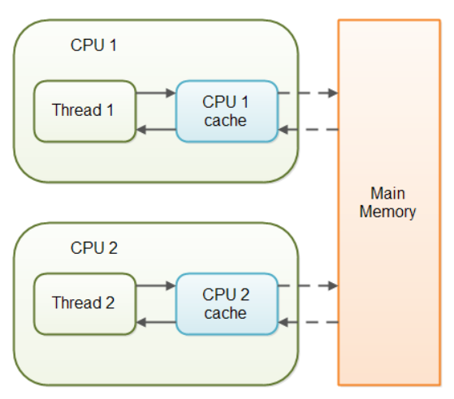
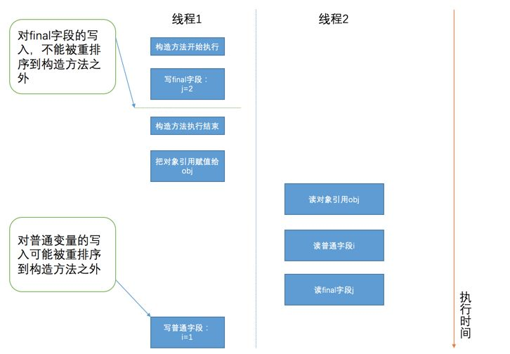
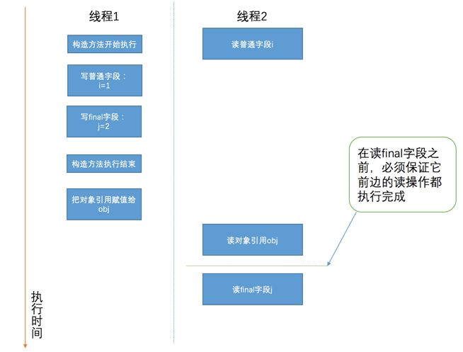

# 并发编程带来的问题

1. 安全性
    **共享变量**：并不是所有内存变量都可以被多个线程共享，当一个线程调用一个方法的时候，会在栈内存上为局部变量以及方法参数申请一些内存，在方法调用结束的时候，这些内存便被释放。不同线程调用同一个方法**此处包括调用``run()``方法**，都会为局部变量和方法参数拷贝一个副本。所以这个栈内存是线程私有的，也就是说局部变量和方法参数是不可以共享的。但是对象或者数组是在堆内存上创建的，堆内存是所有线程都可以访问的，所以包括实例变量，类变量和数组元素是可共享的。所以这些共享变量在并发编程的情况下会出现一些安全性的问题。
    1. 原子性操作
        + 定义：**一个或某几个操作**只能在一个线程执行完之后，另一个线程才能开始执行这些操作，也就是说这些操作是不可分割的，是作为一个整体进行的。线程不能在这些操作上交替执行。``Java``中自带了一些原子性操作，比如给一个**非**``long``、``double``的基本数据类型变量或者引用类型变量进行赋值操作或者读取操作，这些操作``Java``会自己保证是原子性操作的，对于``long``和``double``类型的变量，在32位``JVM``上是不保证原子性操作的。**TODO**
        + 解决办法
            1. 从共享性解决
            我们知道造成共享变量数据不同步是因为多个线程访问了这个共享变量，那么，如果能够让某个共享变量变得不可以被多线程共享，那么就不存在数据不同步的问题。从这个思路出发，有以下两种解决办法：
                + 尽量使用局部变量解决问题
                因为方法中的局部变量(包括方法形参和方法体中创建的变量)是线程私有的，所以无论多少线程调用某个不涉及共享变量的方法都是安全的。所以如果能将问题转换为使用局部变量解决问题而不是共享变量解决，那么就能解决数据访问安全的问题。

                + 使用``ThreadLocal``类
                见``ThreadLocal``类源码分析。[ThreadLocal源码分析](./ThreadLocal.md)

            2. 从可变性解决
            如果一个变量可以被共享，但是它自从被创建并第一次赋初值之后就不能被修改，那么随意哪个线程访问这个变量均不能修改这个共享变量，也就不会有数据安全的问题。所以在允许的条件下，可以将共享数据设置为不可改变。
                + 通过使用``final``关键字
                我们知道，对于一个``final``修饰的变量，如果该变量是基本数据类型的变量，则其数值在初始化后便不能在改变。如果是引用类型的变量，那么一经初始化后，便不能在指向别的对象。但是此时所指的引用内部的属性是可以改变的。
                    + 初始化
                    当``final``修饰类的成员变量时，必须在定义时将其显示初始化，或者构造函数中将其初始化。当初始化之后，便不能被修改，所以可以被多个线程访问，因为线程不能改变这个变量的值，所以也就不存在数据安全的问题。但是如果这个变量又被```static``关键字修饰时，那么只能显示的进行初始化，不能在构造函数中进行初始化。不管怎样，只要初始化之后，便不能被修改。

            3. 加锁的方式来解决
            如果某个变量必须要设置为共享的，即所有的线程均要访问这个变量。且这个变量也是必须要可变的，即每个线程不但能访问到这个变量，并且每个线程都可能会去修改它。那么解决方法1和2均不能适用。此时只能通过加锁的方法来解决。
                + 使用``Synchronized``关键字
                见``Synchronized``关键字分析。[Synchronized关键字分析](./Synchronized.md)
                + 使用``Lock()``实现类显示进行加锁和释放锁。[ReentrantLock()锁的种类](./Lock.md)

    2. 内存可见性与指令重排序（参考**Java并发编程实战第3章**）
    在单线程的环境中，如果向某个变量先写入值，然后在没有其他写入操作的情况下读取这个变量，那么总能得到相同的值。然而，当读操作和写操作在不同的线程中执行，情况可能会出现变化。我们无法确保执行读操作的线程能适时的看到其他线程写入的值。
        1. ``Volatile``关键字分析

            ```java
                public class NoVisibility{
                    private static boolean ready;
                    private static int number;
                    private static class ReaderThread extends Thread{
                        public void run(){
                            while(!ready){
                                Thread.yield();
                            }
                            System.out.println(number)
                        }
                    }
                    public static void main(String[] args){
                        new ReaderThread.start();
                        number = 42;
                        ready = true;
                    }
                }
            ```

            分析：上述代码可能出现的情况：
            + ``Novisibility``可能会持续无限的循环下去。因为尽管在主线程中将``ready``变量的值赋值为``true``，但是，由于主线程可能并不会将该值给刷新到主内存中，那么``ReaderThread``线程永远是在自己的本地缓存中得到``ready``的值。而``ready``值初始为``false``。所以循环会一直下去。即``ReaderThread``线程永远看不到``ready``的最新值。
            + 还有一种可能就是打印输出的结果为0。造成这种现象的原因是发生了指令重排序。即``number = 42;``这条代码被重排序到``ready = true``之前。从而当主线程执行了``ready = true``这行代码之后，线程时间片用完，此时``ReaderThread``线程开始执行。``while``循环条件成立，打印输出``number``。由于``number``此时没有显示的赋值，那么此时的值是默认值``0``。所以输出结果为0。

        2. 内存模型
            

        3. ``final``字段抑制重排序
        规则：
            + 在构造方法内对一个``final``字段的写入不允许被重排序到``构造方法之外``。
            [测试函数](../../JavaSrc/FinalDemoTest.java)
            

            从上图可以看出，普通字段可能在构造方法完成之后才被真正的写入值，所以另一个线程在访问这个普通变量的时候可能读到了0。但是``final``修饰的字段的赋值不允许被重排序到构造方法完成之后，所以该字段所在的对象的引用被赋值出去之前,``final``字段肯定被赋值过了。

            + 初次读一个包含final字段对象的引用，与随后初次读这个final字段，这两个操作不能重排序。
            
            从上图可以看出，普通字段的读取操作可能被重排序到读取该字段所在对象引用前边，自然会得到``NullPointerException``异常喽，但是对于``final``字段，在读``final``字段之前，必须保证它前边的读操作都执行完成，也就是说必须先进行该字段所在对象的引用的读取，再读取该字段，也就是说这两个操作不能进行重排序。即**在读一个对象的final域之前，一定会先读这个包含这个final域的对象的引用。**

            + 对于引用类型的``final``变量：
            增加约束：***一个final修饰的对象的成员域的写入，与随后在构造函数之外把这个被构造的对象的引用赋给一个引用变量，这两个操作是不能被重排序的***。

            + ``final``字段一旦被赋值成功，那么它的值在之后的程序执行过程中都不会发生改变，也不存在所谓的**内存可见性**的问题

        4. 线程不安全的另外一个例子

        ```java
            /*

             */
            public class MutableInteger{
                private int value;
                public int get(){
                    return value;  // 得到的可能是已经失效的值
                }
                public void set(int value){
                    this.value = value;  // 设置的值可能不会立马刷新到主内存中
                }
            }
        ```


2. 活跃性

    1. 死锁

        ```java
            import java.util.concurrent.TimeUnit;

            public class DeadLock {
                public static void main(String[] args) {
                    Locks locks = new Locks();
                    //由于在构造不同的任务的时候，传入的是同一个锁对象，即这两个任务中用到的锁是同两把锁。即lockA,lockB
                    new Thread(new TargetByThreadOne(locks), "ThreadOne").start();
                    new Thread(new TargetByThreadTwo(locks), "ThreadTwo").start();

                }
            }


            //锁对象，用来产生锁。
            class Locks {
                Object lockA = new Object();
                Object lockB = new Object();
            }

            class TargetByThreadOne implements Runnable {
                Locks locks = new Locks();

                public TargetByThreadOne(Locks locks) {
                    this.locks = locks;
                }

                @Override
                public void run() {
                    synchronized (locks.lockA) {
                        System.out.println(Thread.currentThread().getName() + "：获取了lockA锁");
                        try {
                            TimeUnit.SECONDS.sleep(5);
                        } catch (InterruptedException e) {
                            e.printStackTrace();
                        }
                        // 执行到这一步，A锁并没有释放，并且此时去获取B锁，由于之前经过休眠了5秒，在这里Two线程执行，将B锁获取到了，所以此时没法获取B锁
                        synchronized (locks.lockB) {
                            System.out.println(Thread.currentThread().getName() + "：获取了lockB锁");
                        }
                    }
                }
            }

            class TargetByThreadTwo implements Runnable {
                Locks locks = new Locks();

                public TargetByThreadTwo(Locks locks) {
                    this.locks = locks;
                }

                @Override
                public void run() {
                    // 在A休眠的时候或者刚开始执行的线程是Two，将B锁获取到了。
                    synchronized (locks.lockB) {
                        System.out.println(Thread.currentThread().getName() + "：获取了lockB锁");
                        try {
                            TimeUnit.SECONDS.sleep(5);
                        } catch (InterruptedException e) {
                            e.printStackTrace();
                        }

                        synchronized (locks.lockA) {
                            System.out.println(Thread.currentThread().getName() + "：获取了lockA锁");  // A锁已经被One线程获取
                        }
                    }
                }
            }
        ```

        + 死锁分析：
            + 死锁产生的原因：每个线程都拥有其他线程需要的资源，同时又等待其他线程已经拥有的资源，并且每个线程在获得全部需要的资源之前不会释放已经拥有的资源。那么就可能会发生死锁。我们也注意到了，我们说**锁其实本身就是一种线程执行需要获取的资源，任何可以被共享的东西都可以被当作一种资源来对待**。

    2. 活锁

    3. 饥饿
    线程饥饿是另一种活跃性问题，也可以使程序无法执行下去。如果一个线程因为处理器时间全部被其他线程抢走而得不到处理器运行时间，这种状态被称之为饥饿，一般是由高优先级线程吞噬所有的低优先级线程的处理器时间引起的。java语言在Thread类中提供了修改线程优先级的成员方法setPriority，并且定义了10个优先级级别。不同操作系统有不同的线程优先级，java会把这10个级别映射到具体的操作系统线程优先级上边。操作系统的线程调度会按照自己的调度策略来轮番执行我们定义的线程。我们所设置的线程优先级对操作系统来说只是**一种建议**，当我们尝试提高一个线程的优先级的时候，可能**起不到任何作用**，也可能**使这个线程过度优先执行**，导致别的线程得不到处理器分配的时间片，从而导致饿死。所以我们尽量不要修改线程的优先级，具体效果取决于具体的操作系统，并且可能导致某些线程饿死。

