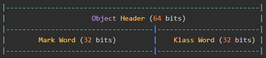
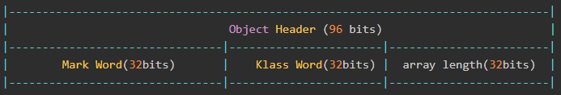
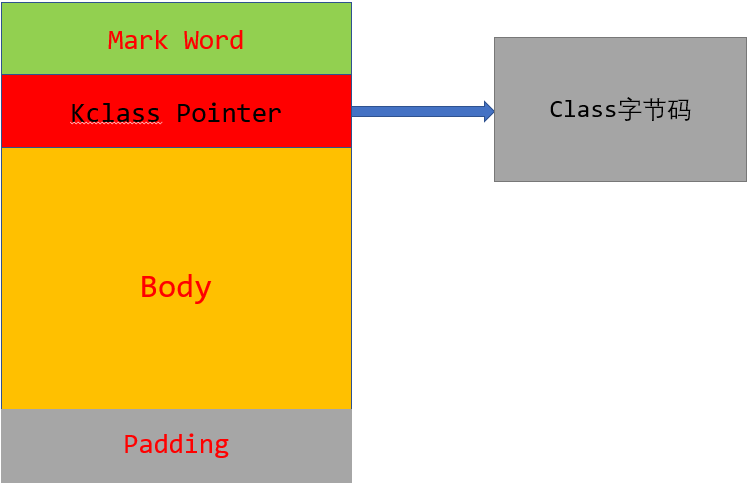
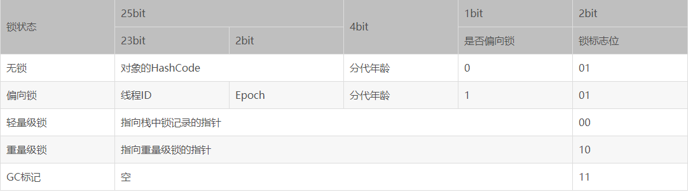
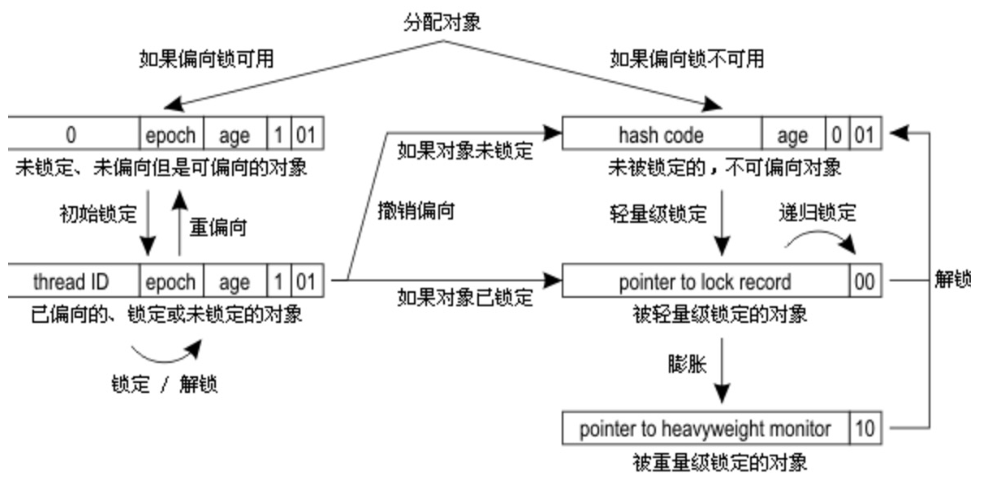

# ``Synchronized``与``Lock``实现类源码分析

## ``Java``对象内存布局（以32位虚拟机为例）

在``HotSpot``虚拟机中，对象在内存中的存储布局可以分为3个部分。分别如下：

1. 对象头

    1. 对于普通对象，对象头所占的内存位数如下：
    
    2. 对于数组对象，会格外增加一部分来记录数组得长度，具体如下所示：
    
    3. **说明**：
        1. 在32位``JVM``中：
            + ``Mark Word``占32位。记录了对象和锁有关的信息，当这个对象被``synchronized``关键字当成同步锁时，围绕这个锁的一系列操作都和``Mark Word``有关。
            + ``Klass Word``占32位。指向这个对象所属类得类元数据的指针，虚拟机通过这个指针来确定这个对象是属于哪个类的实例。像类的方法、常量池这些信息都是存在klass里的，你可以认为它是java里面的java.lang.Class对象，记录了类的全部信息。而这个``Klass Word``即指向了这个``Klass``。
            + ``array length``占32位。代表着数组对象的数组长度。

        2. 在64位虚拟机中：
            + 如果没有开启压缩，即``+UseCompressedOops``，那么：
                1. 对于普通对象：``klass Word``和``Mark Word``均是8字节。即对象头16字节。
                2. 对于数组对象：``array length``、``klass Word``和``Mark Word``均是8字节。即对象头24个字节
            + 开启压缩，则：
                1. 对于普通对象：存放``klass Word``指针的空间大小是4字节，``Mark Word``是8字节，对象头为12字节，加上对齐4字节，总共16字节。
                2. 对于数组对象：``array length``4字节，``klass Word``和``Mark Word``均是4字节，加上对齐4字节，等于16字节。
        3. 综上：对象头部分正好是8字节的倍数。可能位1倍。也可能为2倍或者3倍。

2. 实例数据
    1. 实例数据部分是对象真正存储的有效信息，也是在程序代码中所定义的各种类型的字段内容。无论是从父类继承下来的，还是在子类中定义的，都需要记录起来。注意不包括方法和静态属性。

3. 对齐填充
    1. 第三部分对齐填充并不是必然存在的，也没有特别的含义，它仅仅起着占位符的作用。由于HotSpot VM的自动内存管理系统要求对象起始地址必须是8字节的整数倍，换句话说，就是对象的大小必须是8字节的整数倍。而对象头部分正好是8字节的倍数（1倍或者2倍），因此，当对象实例数据部分没有对齐时，就需要通过对齐填充来补全。

4. 示意图
    
    1. 有继承的对象属性分布
    

5. ``Mark Word``分析
    1. 这部分主要用来存储对象自身的运行时数据，如``hashcode``、``gc``分代年龄等。``mark word``的位长度为``JVM``的一个``Word``大小，也就是说32位``JVM``的``Mark word``为32位，64位``JVM``为64位。为了让一个字大小存储更多的信息，JVM将字的最低两个位设置为标记位，不同标记位下的``Mark Word``示意如下：
        
    **说明**：各个字段含义如下：
        + ``lock``：占2位。表明对象此时的锁状态的标志位。状态见``State``列所示

        + ``biased_lock``：占1位，表明是否为偏向锁

        + ``age``：占4位。``Java``对象年龄。由于仅仅用4位来表示对象的年龄，最大值为15。所以这就是``-XX:MaxTenuringThreshold``选项最大值为15的原因

        + ``thread``：持有偏向锁的线程``ID``

        + ``epoch``：偏向时间戳。``ptr_to_lock_record``：指向栈中锁记录的指针。``ptr_to_heavyweight_monitor``：指向管程``Monitor``的指针。
        + 其中无锁和偏向锁的锁标志位都是01，只是在前面的1``bit``区分了这是无锁状态还是偏向锁状态。**特别注意：偏向锁在``JDK6``以及以后的``JVM``是默认启用的，可以通过``JVM``参数关闭偏向锁：``-XX:-UseBiasedLocking=false``。当偏向锁被禁用时，那么此时对象的初始状态即为无锁状态。即表格中的第一行。此时存储着对象的``HashCode``，分代年龄等**。

    2. 流程（默认偏向锁打开的前提下）
        
        1. 获取偏向锁
            1. 初始状态下首先判断是否是``可偏向``的状态（**即是否调用``-XX:-UseBiasedLocking=false``将偏向锁关闭，默认是打开的状态**），如果可偏向（此时初始状态下，``ThreadId == 0``），那么会通过``CAS``操作来尝试将自己的线程``ID``写入到``Mark Word``中。注意为啥要用``CAS``操作呢，因为可能此时别的线程会先一步将自己的线程``ID``写入。
                + 如果``CAS``操作成功，说明此时获取到了偏向锁，此时执行同步代码块。（即图中的**初始锁定标记的**箭头代表的部分）
                + 如果失败，说明此时有别的线程``B``抢先一步执行了图中**初始锁定标记的**箭头指示的操作。那么说明此时竞争激烈，需要撤销``B``获取到的偏向锁，将其升级为轻量级锁。
            2. 如果此时已经是偏向状态（即此时``ThreadId != null``），那么会检测当前的``ThreadId``与此时需要获取锁的``ThreadId``是否想相同。**注意，偏向锁是不会主动释放锁的**。如果相同，说明是之前的线程又重新获取锁，那么直接执行同步代码块。如果不相同，说明该对象目前偏向于其他线程，需要撤销偏向锁。
                + 偏向锁的撤销是一个很特殊的操作，为了执行撤销操作，需要等待全局安全点``Safe Point``，此时所有的工作线程都停止了字节码的执行。（不代表着所有的线程都执行**完**了字节码）
                    1. 偏向锁的撤销可能出现两种情况：
                        + 直接由偏向状态转换成无锁的状态（对应于图中的**如果对象未锁定**箭头指示的操作）。原来已经获取了偏向锁的线程可能已经执行完了同步代码块，使得对象处于闲置的状态，即尽管此时``Mark Word``仍存有线程``ID``，但是实际上已经没有锁定了。相当于这个偏向锁无效。那么直接被转换成无锁的状态。撤销操作完成。

                        + 原来的偏向锁线程在到达全局安全点的时候，还没有执行完同步代码块，所以，会通过``Mark Word``找到当前的线程``ID``，然后在该线程的**栈帧**中补充上轻量级加锁时会保存的锁记录，然后``Mark Word``指向这个锁记录。至此撤销操作完全完成，然后这个线程会继续执行未执行完的代码。由偏向状态转换成轻量锁状态。对应图中**如果对象已锁定**箭头指示的操作。

                    2. 当由偏向状态转换成无锁状态之后，然后转变成轻量级锁
                        + 虚拟机首先会在当前线程的栈帧中建立一个名为锁记录的空间，用于存储锁对象当前得``Mark Word``拷贝，然后拷贝对象头中得``Mark Word``复制到锁记录中。然后通过``CAS``操作将锁对象的``Mark Word``更新为指向这个锁记录的指针，若成功，说明当前线程获取到锁。**若失败，虚拟机首先会检查对象的``Mark Word``是否指向当前线程的栈帧，如果成立，说明当前线程已经拥有了这个锁对象，那么直接进入到同步代码块执行，否则说明多个线程竞争锁**。**存疑，两份资料讲的不一样，为啥要判断此时是否为当前线程呢**？可能的一个解释：由于``Synchronized``是可重入锁，所以一个线程可能多次获取同一把锁。所以``CAS``的期望值应该是无锁状态下的``Mark Word``的值。而更新值应该是此时所记录所在的内存地址。那么如果失败，说明此时``Mark Word``的值不为无锁状态下的值。但是可能是当前线程锁记录所在的内存地址。所以如果是这样，那么说明是锁的重入。说明当前线程已经拥有了这个锁对象。所以直接继续执行同步代码块。
                        + 若当前只有一个等待线程，则该线程通过自旋等待。但当自旋超过一定的次数，或者一个线程持有锁，一个线程自旋，又有第三个线程来访，那么轻量级锁升级为重量级锁。
                    3. 轻量锁在释放后，锁对象转变成无锁的状态。

        2. 重量级锁
            1. **TODO**

        3. 设计原理
            1. 对``Synchronized``锁进行优化，经历各种状态，主要有以下优点
                + 偏向锁通过对比``Mark Word``解决了加锁的问题，避免了执行``CAS``操作。而轻量级锁是通过用``CAS``操作和自旋来解决加锁问题，避免了线程阻塞和唤醒线程而影响性能。重量级锁是将除了拥有锁的线程以外的线程都阻塞。所以名称是重量级锁

6. ``Synchronized``的用法
    + 修饰实例方法，进入同步代码前要获得锁便是当前实例独享。当一个线程正在访问一个对象的``synchronized``修饰的实例方法，那么其他线程不能访问该对象的其它``synchronized``修饰的实例方法。因为该实例对象仅仅有一把锁。但是其他线程还是可以访问该实例对象的其他非synchronized方法。因为访问这些方法并不需要进行获取锁的操作。

    + 修饰静态方法，进入同步代码前要获得当前类对象的锁。需要注意的是如果一个线程``A``调用一个实例对象的非``static``且被``synchronized``修饰方法，而线程``B``需要调用这个实例对象所属类的``static synchronized``方法，是允许的，不会发生互斥现象，因为访问``static synchronized``方法占用的锁是当前类的``class``对象，而访问非``static``，``synchronized``方法占用的锁是当前实例对象锁

    + 修饰代码块，指定加锁对象，进入同步代码库前要获得给定对象的锁。这把锁可以是``this``，或者``.class``，或者``obj``。其中：``Object obj = new Objet()``。
