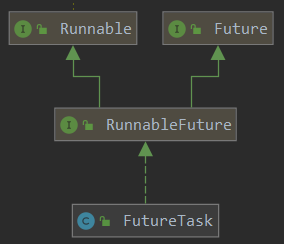

# 线程

## 创建线程的3种方式

``Java``中线程所执行的任务被抽象成了一个``Runnable``接口。所有任务都应该是``Runnable``接口的子接口，或者实现了这个接口的子类。而``Callable``接口不是``Runnable``接口的子接口，所以**不能被线程直接当作任务来执行**。需要用``FutureTask``来进行包装。而``FutureTask``实现了``RunnableFuture``接口，``RunnableFuture``接口继承了``Runnable``和``Future``接口。所以``FutureTask``类实例可以作为任务被``Thread``来执行。

1. 继承``Thread``类

    ```java
    public class Thread implements Runnable {

        private Runnable target;


        public Thread(Runnable target) {
            //构造方法中传入任务对象给成员变量target
            init(null, target, "Thread-" + nextThreadNum(), 0);
        }

        public Thread(Runnable target, String name) {
            //传入任务和线程名字
            init(null, target, name, 0);
        }

        public Thread() {
            //什么都不传入，此时target初始化为null
            init(null, null, "Thread-" + nextThreadNum(), 0);
        }

        @Override
        public void run() {

            //override Runnable接口中的run()方法。该run()方法执行target
            //而terget即传入的任务对象
            if (target != null) {
                target.run();  // 如果target为空，即创建该线程实例时没有传入任务，那么该线程什么都不做
            }
        }

        // ... 省略其他方法和字段
    }
    ```

    可见，``Thread``类本身就实现了``Runnable``接口。``Thread``类就是一个线程类，``Java``中所有的线程实例都是``Thread``类或者其子类的实例。``Thread``实例化时将传入的任务对象赋值给**成员变量**``target``。然后``run()``方法中执行的就是这个任务。我们创建自己的线程实例，可以继承``Thread``类，然后重写``run()``方法。而``run()``方法即是要执行的具体任务任务。也可以不重写``run()``方法。子类构造器中调用父类的构造函数，传入任务对象。``super(target)``。**愚蠢的方法**

2. 使用``Callable``和``FutureTask``创建线程

    1. ``Callable``接口源码如下

        ```java
        public interface Callable<V> {
            /**
             * Computes a result, or throws an exception if unable to do so.
             * @return computed result
             * @throws Exception if unable to compute a result
             *
             * call()方法与run()方法类似，即线程执行体。比run()方法更强大，主要在于
             * 有返回值。并且可以声明抛出异常
             */


            V call() throws Exception;
        }
        ```

        ``Callable``是一个范型接口，``V``即是``call()``方法返回值类型，并且该方法抛出的异常为``Exception``。子类重写``call()``方法，要注意方法``override``的规则。即**两同**，**两小**，**一大**。方法名相同，形参列表相同。返回值类型要比父类方法返回值**类型小或者相等**，抛出的异常要比父类方法抛出的异常**范围小**，访问权限要比父类方法的访问权限相等或者要大。即**如果是实现接口中的方法**，那么子类中方法的访问权限一定是``public``。因为接口中的方法的访问权限是``public``。

    2. ``Future``

        是一个接口，提供了一些对任务进行处理的相应操作的方法。
        1. 源码如下（``FutureTask``类的实现）

            ```java

            /**
             * cancell()方法返回true，那么该方法肯定返回true
             * 因为只要cancell()方法能够成功执行，那么任务最终
             * 得状态肯定是CANCELL或者INTERRUPTED，那么state肯定是大于
             * CANCELL的。所以返回true
             */
            public boolean isCancelled() {
                return state >= CANCELLED;
            }


            /**
             * 只要线程的状态不为NEW，那么就返回ture
             */
            public boolean isDone() {
                return state != NEW;
            }

            /**
             * 如果线程还没有执行完任务，那么会使当前线程（即调用该方法的线程）阻塞。
             */
            public V get() throws InterruptedException, ExecutionException {
                int s = state;
                if (s <= COMPLETING)
                    s = awaitDone(false, 0L);
                return report(s);
            }

            /**
             * 等待参数时间，如果在规定的时间内还没有任务还没有结束，那么直接抛出TimeoutException
             */
            public V get(long timeout, TimeUnit unit)
                    throws InterruptedException, ExecutionException, TimeoutException {
                if (unit == null)
                    throw new NullPointerException();
                int s = state;
                if (s <= COMPLETING &&
                        (s = awaitDone(true, unit.toNanos(timeout))) <= COMPLETING)
                    throw new TimeoutException();
                return report(s);
            }
            ```

    3. ``FutureTask``

        包装``Callable``实例。因为``Callable``不是``Runnable``的子接口，所以不能直接作为``Thread``的``target``，所以要对``Callable``对象进行包装。使之能作为``target``被``Thread``执行。由于``FutureTask``实现了``Runnable``接口，所以可以作为``target``被``Thread``执行。所以要用``FutureTask``来包装``callable``实例，从而能够被``Thread``当成任务执行。
        
        根据``FutureTask``的``run()``函数源码可知，``FutureTask``只能被执行一次。``FutureTask``作为一个任务类（因为是``Runnable``接口的实现类），创建该类实例即代表着创建了一个任务实例。任务也定义了几个状态，从而用来支撑``cancell()``方法来取消任务。

        ```java
        /**
         * The run state of this task, initially NEW.  The run state
         * transitions to a terminal state only in methods set,
         * setException, and cancel.  During completion, state may take on
         * transient values of COMPLETING (while outcome is being set) or
         * INTERRUPTING (only while interrupting the runner to satisfy a
         * cancel(true)). Transitions from these intermediate to final
         * states use cheaper ordered/lazy writes because values are unique
         * and cannot be further modified.
         * <p>
         * Possible state transitions:
         * NEW -> COMPLETING -> NORMAL
         * NEW -> COMPLETING -> EXCEPTIONAL
         * NEW -> CANCELLED
         * NEW -> INTERRUPTING -> INTERRUPTED
         * 线程的状态只能被set(),setException(),cancel()方法所改变。
         */
        private volatile int state;
        private static final int NEW = 0;
        private static final int COMPLETING = 1;
        private static final int NORMAL = 2;
        private static final int EXCEPTIONAL = 3;
        private static final int CANCELLED = 4;
        private static final int INTERRUPTING = 5;
        private static final int INTERRUPTED = 6;
        private volatile Thread runner;  // 执行这个FutureTask任务的线程对象
        private Callable<V> callable;  // 被包装的calllable实例对象
        ```

        1. 源码

            ```java

            /**
             * Thread执行的还是FutureTask的run()方法。只不过FutureTask的run()将Callable对象的call()方法进行了封装
             * 即本质上是在FutureTask的run()方法里调用了Callable对象的call()方法，
             * FutureTask在创建实例时，会将传入的Callable对象实例赋值给内部成员变量callable，然后通过callable.call()
             * 来实现在FutrueTask的run()里调用call()方法
             */
            public void run() {
                //FutureTask是只能只能一次的任务，当第一次执行完之后，那么任务的状态就不能再次回到NEW状态。
                if (state != NEW ||
                    !UNSAFE.compareAndSwapObject(this, runnerOffset,
                                                null, Thread.currentThread()))

                    //注意：同一时间只能有一个线程执行run方法成功，因为在执行run()之前，首先要
                    //判断此时有没有线程在执行，即如果没有线程即null，那么CAS执行成功返回true。取反为false。
                    return;
                try {
                    Callable<V> c = callable;
                    if (c != null && state == NEW) {  // 即如果这个if条件判断成立，那么call()方法可能会执行
                    //可能会抛出出现中断异常
                        V result;
                        boolean ran;
                        try {

                            //注意：在执行set和setException()方法之前，线程的状态一直为NEW
                            result = c.call(); //执行callable的call()方法。而callable即是传入的参数
                            ran = true;
                        } catch (Throwable ex) {
                            result = null;
                            ran = false;
                            setException(ex);  // 调用call()方法发生异常，将任务状态从NEW->COMPLETING->EXCEPTIONAL
                        }
                        if (ran)
                            set(result);  // 将状态从NEW->COMPLETING->NORMAL.即任务正常执行完状态变化
                    }
                } finally {
                    // runner must be non-null until state is settled to
                    // prevent concurrent calls to run()
                    runner = null;
                    // state must be re-read after nulling runner to prevent
                    // leaked interrupts
                    int s = state;
                    if (s >= INTERRUPTING)
                        handlePossibleCancellationInterrupt(s);
                }
            }

            protected void set(V v) {
                //原子性将任务从NEW->COMPLETING。即如果cancell()方法在该方法之前执行
                //那么set()方法直接失败
                if (UNSAFE.compareAndSwapInt(this, stateOffset, NEW, COMPLETING)) {
                    outcome = v;
                    UNSAFE.putOrderedInt(this, stateOffset, NORMAL); // final state
                    finishCompletion();
                }
            }

            // 同理，也是原子性将任务状态从NEW->COMPLETING
            protected void setException(Throwable t) {
                if (UNSAFE.compareAndSwapInt(this, stateOffset, NEW, COMPLETING)) {
                    outcome = t;
                    UNSAFE.putOrderedInt(this, stateOffset, EXCEPTIONAL); // final state
                    finishCompletion();
                }
            }

            public boolean cancel(boolean mayInterruptIfRunning) {
                /*
                如果线程不是NEW状态，说明任务已经完成，已经被成功取消，或者被中断。
                那么方法直接返回false。如果是NEW状态，并且后续
                也能原子性将状态从NEW->INTERRUPTING或者CANCELLED，那么执行接下来的
                语句部分，最终返回true

                1. 如果mayInterruptIfRuning为true，那么状态NEW->INTERRUPTING->INTERRUPTED
                2. 如果mayInterruptIfRuning为false，那么状态NEW->CANCELLED

                不论是1还是2，最终都会返回true。
                */
                if (!(state == NEW &&
                //也就是说只要Task还没有执行，那么只要执行cancell，那么状态肯定会从NEW转变成其他状态
                        UNSAFE.compareAndSwapInt(this, stateOffset, NEW,
                                mayInterruptIfRunning ? INTERRUPTING : CANCELLED)))
                    return false;
                try {    // in case call to interrupt throws exception
                    if (mayInterruptIfRunning) {
                        try {
                            Thread t = runner;
                            if (t != null)  // 此处可能为null，因为可能无线程执行这个任务
                                t.interrupt();  // 中断正在执行这个任务的线程
                        } finally { // final state，将任务的状态设置为INTERRUPTED.
                            UNSAFE.putOrderedInt(this, stateOffset, INTERRUPTED);
                        }
                    }
                } finally {
                    finishCompletion();  // 不会进行线程状态的设置
                }
                return true;
            }
            // TODO runAndReset()方法

            /**
             * cancell()和run()方法交叉执行分析：
             * 1.因为在run()方法中，本质上执行的是callable实例对象的call()方法
             * 并且在未执行set()方法或者setException()方法之前，任务的状态仍然是NEW
             *
             * 2. 分情况讨论：
             *
             * 2.1.如果Task已经被线程执行，即代码已经执行到调用call()方法（正在调用或者调用完，状态还没改变），
             *     然后执行cancell()方法
             *
             *     1.调用cancell(false)成功即cancell()方法if条件判断不成立：
             *       如果此时callable.call()还没有返回，或者已经返回了，但是状态还没有发生改变
             *       即还没有调用set()或者setException()（发生异常的情况下会调用这个方法，并且
             *       不会再调用set()方法），那么callable()不会对任务的执行（即执行call()方法）有
             *       什么影响。仅仅会改变任务状态（即任务的最终状态是cancell）。然后cancell(fasle)
             *       方法最终返回true
             *
             *     2.调用cancell(true)成功即也是if条件判断不成立:
             *       此时set()和setException()会更新状态失败。cancell()方法会将线程的中断标志位
             *       设置为true。如果call()没有返回，那么可能会对任务有影响。因为任务可能会相应中断。
             *       如果call()已经返回，那么仅仅会改变任务的状态（任务的最终状态为Inerrupted）
             *
             *     3.注意上述cancell()方法中if条件判断不成立的意思：即此时任务状态为NEW，并且也成功
             *       原子性的将任务状态从NEW更新为CANCELL或者INTERRUPTING，说明cancell执行成功，
             *       不会返回false，最终返回true。并且最终任务的状态为cancell或者interrupted。
             *       注意条件前面有一个 ! .
             *
             *2.2.先调用cancell()方法成功再执行Task，即此时Task的run()方法if()判断是在cancell()执行成功之后
             *    进行的
             *
             *     1.因为call()不论传入的参数是true还是false。cancell()方法的成功调用都会改变此时任务的状态。
             *        所以肯定Task不会执行，因为Task执行的前提任务状态必须是NEW。
             *
             *2.3.cancell()成功调用会返回true。失败会返回false。如果cancell()方法返回true，说明零最终的任务
             *    状态为cancell或者是interrupted，由于isCancelled()源码判断state>=CANCELL则返回true，所以
             *    isCancelled()方法返回true。但cancell()方法返回true。不代表任务call()方法就没有被执行。
             *
             *2.4.isDone()方法判断此时任务的状态是不是NEW，如果是，那么返回true，如果不是，那么返回false.
             */

            ```

        2. 构造方法

            ```java

            /**
             * 直接传入一个Callable对象，将实例赋值给内部成员变量callable
             */
            public FutureTask(Callable<V> callable) {
                if (callable == null)
                    throw new NullPointerException();
                this.callable = callable;
                this.state = NEW;  // 创建一个FutureTask实例，会将State状态设置为NEW.
            }


            /**
             * 传入Runnable对象实例和V类型的结果，如果成功执行完成，返回result
             */
            public FutureTask(Runnable runnable, V result) {
                this.callable = Executors.callable(runnable, result);
                this.state = NEW;
            }


            /**
             * Executors.callable()方法
             */
            public static <T> Callable<T> callable(Runnable task, T result) {
                if (task == null)
                    throw new NullPointerException();
                return new RunnableAdapter<T>(task, result);
            }

            /**
             * 注意：RunnableAdapter类实现了Callable类
             */
            static final class RunnableAdapter<T> implements Callable<T> {
                final Runnable task;
                final T result;
                RunnableAdapter(Runnable task, T result) {
                    this.task = task;
                    this.result = result;
                }

                //call()方法本质上是调用Runnable的run()方法
                public T call() {
                    task.run();
                    return result;  // run()方法成功完成，那么会将result返回
                }
            }

            /**
             * FutureTak传入Runnable流程：
             * 1.FutureTask构造器中调用Executors.callable()方法。该方法里仅仅是调用
             *   类RunnableAdapter的构造函数
             *
             * 2.RunnableAdapter类实现了Callable接口，所以能被FutureTask进行包装，即
             *   在FutureTask构造其中将其传给FutureTask的callable成员变量
             *
             * 3.通过RunnableAdapter类的构造函数，将Runnable类型的task传给Runnable类实例
             *   成员变量task，result传给类成员变量result。
             * 3.Runnable实现了Callable接口，重写call()方法。而call()方法本质调用了Runnable实例的
             *   run()方法，返回值即是传入的result。
             *
             * 4.FutureTask里的run()方法本质上调用了成员变量的call()方法，此处即使RunnableAdapter类实例
             *  的call()方法。而RunnableAdapter得call()方法是调用了传入到FutureTask构造器得Runnable实例
             *  构造器得run方法。并且返回值也是传入构造器得result（如果没有传入，那么默认赋值为null）。
             *
             * 5.这样就实现了将Runnable对象包装成callable对象，从而也能实现被FutureTask进一步包装。
             */

            ```

        3. 适配器模式

        ```java
        //TODO
        ```
