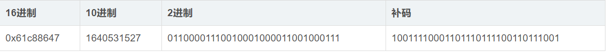
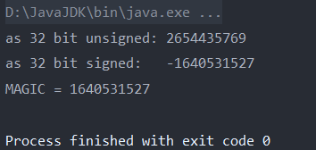
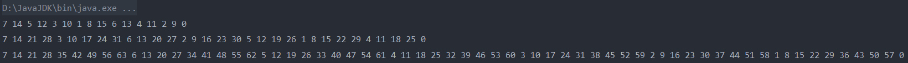
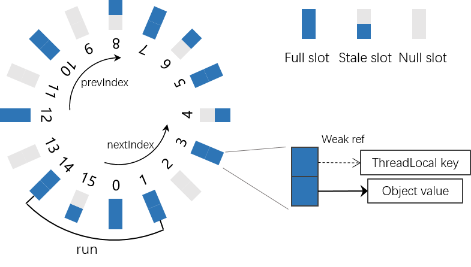
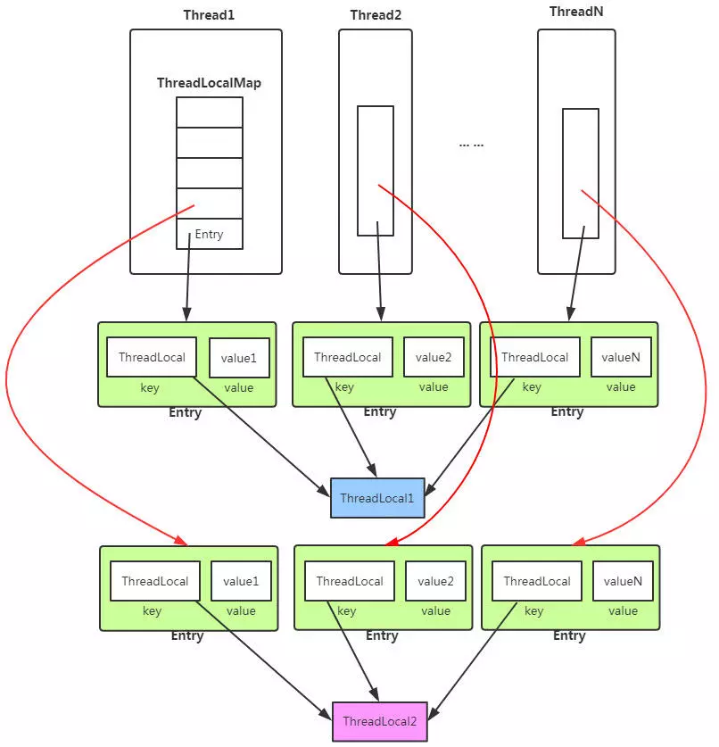

# ThreadLocal源码分析

ThreadLcoal类是线程局部变量类。要创建一个线程局部变量，那么要先实例化一个线程局部变量。

1. 构造函数

    ```java

        /*
         1.ThreadLocal类的内部有一个静态内部类ThreadLocalMap，这个类实际存储
         key-value键值对。而ThreadLocal提供了对这个ThreadLocalMap操作的各种方法。

         2.每个线程对象（所有的线程对象都必须是Thread类或其子类的实例）均含有一个
         ThreadLocalMap类型的成员变量  threadLocals，即ThreadLocal.ThreadLocalMap threadLocals = null;
         这个变量指向了属于该线程对象的ThreadLocalMap。而ThreadLocalMap是
         ThreadLocal类的一个静态内部类。类似于HashMap，ThreadLocalMap内部有一个静态内部类Entry。且继承于类WeakReference。
         而这个静态内部类Entry是真正存储了key-value映射。（内部成员变量private T referent;存储key，Object value;存储value）

         3.注意每一个线程对象都有ThreadLocalMap与之相关联，且此时线程对象内部的threadLocals属性指向了这个ThreadLocalMap。
         不同线程对象之间的ThreadLocalMap是相互独立的，从而保证了线程局部变量。
         但是可以创建很多个ThreadLocal类实例。每一个ThreadLocal对象实例即对应着
         ThreadLocalMap中Entry中的key（本质上这个key指向了这个ThreadLocal实例对象，且是一个弱引用），value就是
         创建这个ThreadLocal类的实例时初始化的值（如果没有override初始化函数或者调用set()函数设置，那么第一次get()方法返回null）。
         */
        public ThreadLocal() {
            /*
             1.空构造函数，即当创建一个新的ThreadLocal类的实例对象的时候，并
             没有创建ThreadLocalMap对象。ThreadLocalMap只有在调用ThreadLocal的set(),get()等
             方法时，先检查有没有创建属于该线程对象的ThreadLocalMap，即线程对象内部的threadLocals成员属性是否为null。
            */
        }
    ```

2. 重要方法
    1. ``ThreadLocal``相关方法

        ```java
            /*
            1.可能没先调用set()方法调用直接调用get()方法来获取值。这种情况下，会新
            建一个threadlocalmap。并且将默认的key-value插入。这个默认的key
            毫无疑问，是当前threadlcoal对象的弱引用。这个value是调用initValue()方法来得
            到的，如果在创建ThreadLocal实例时没有override initValue()方法的话，那么这个initValue()的
            返回值就是null（但是我们一般会重写这个inintValue()方法）。
            */
            public T get() {
                Thread t = Thread.currentThread();  // 获取当前线程对象，可能是主线程或者其他的线程
                ThreadLocalMap map = getMap(t);  // 获取该线程对象的threadLocals实例变量
                if (map != null) {  // 如果条件不成立，说明此时还没有初始化对应于该线程的ThreadLocalMap。即此时线程对象的threadLocals属性值为null
                    ThreadLocalMap.Entry e = map.getEntry(this);  // 根据this即key来获取相应的Entry
                    if (e != null) {  // TODO。这里为什么还要判断e是否为null?
                        @SuppressWarnings("unchecked")
                        T result = (T)e.value;  // 直接获取到value并返回
                        return result;
                    }
                }
                return setInitialValue();  // 该方法调用的情况 1.map为null，2.e为null。即可能没有没有对应于该ThreadLocal实例的Entry（因为发生hash冲突散列到其他地方）
                /*
                1.懒汉式初始化。只有当map == null时才会进行初始化操作。即在没有进行set()操作
                就执行get()操作，那么会返回初始值。这个初始值可以被显示初始化赋值

                2.通过创建ThreadLcoal实例时重写initialValue()函数来进行显示赋值。否则的话返回null
                */
            }

            ThreadLocalMap getMap(Thread t) {
                return t.threadLocals;
            }

            private T setInitialValue() {
                T value = initialValue();  //注意：initialValue()函数若没有被重写，那么返回值总是null
                Thread t = Thread.currentThread();
                ThreadLocalMap map = getMap(t);
                if (map != null)
                    map.set(this, value);
                else
                    createMap(t, value);
                return value;
            }

            protected T initialValue() {
                return null;  // 该方法一般会被重写。从而可以赋予其默认的初始值。
            }


            public void set(T value) {
                Thread t = Thread.currentThread();  // 获取当前线程。因为代码总是在一个线程中。主线程或者是其他线程。
                ThreadLocalMap map = getMap(t);  // 根据当前线程来获取这个线程threadLocals。而这个threadLocals指向了ThreadLocalMap，注意set方法是被ThreadLocal实例调用的。
                if (map != null)  // 说明已经初始化，那么直接插入
                    map.set(this, value);
                    /*
                    1.this指的是当前调用这个set()方法的ThreadLocal的实例。当一个线程多次调用同一个threadLocal实
                    例的set()方法。其实是新值取代旧值的过程。除非用不同的threadlocal实例来调用这个set()方法。这样的话，
                    就相当于对应于这个线程的threadlocalmap中存放了两个key -value键值对。一个key是第一个threadlocal实例。另外一个key是第二个threadlocal实例。以此类推。
                    */
                else
                    createMap(t, value);  // 说明还没有初始化ThreadLcoalMap。即此时线程中得threadLocals为null。那么新创建map并key-value对写入。
            }

            void createMap(Thread t, T firstValue) {
                //创建新的ThreadLocalMap。并将初始key-value对存入到ThreadLocalMap得Entry中。即存放key-value的结构
                t.threadLocals = new ThreadLocalMap(this, firstValue);  // 返回值赋值给这个线程对象的threadLocals成员属性
            }

            //下面是ThreadLocal的remove()方法
            public void remove() {
                ThreadLocalMap m = getMap(Thread.currentThread());
                if (m != null)
                    m.remove(this);
            }

        ```

    2. ``ThreadLocalMap``相关方法

        ```java
            ThreadLocalMap(ThreadLocal<?> firstKey, Object firstValue) {
                    table = new Entry[INITIAL_CAPACITY];  // 这个一个数组，类比于HashMap中的table。即数组中的每一个元素都是Entry节点
                    int i = firstKey.threadLocalHashCode & (INITIAL_CAPACITY - 1);  // 计算这个key-value散列到数组的位置
                    table[i] = new Entry(firstKey, firstValue);  // 在ThreadLocalMap的构造函数中新初始化一个Entry节点，来存储这个键值对
                    size = 1;
                    setThreshold(INITIAL_CAPACITY);
            }

            private final int threadLocalHashCode = nextHashCode();

            private static int nextHashCode() {
                return nextHashCode.getAndAdd(HASH_INCREMENT);  // CAS原子性操作。因为这个变量是每一个线程共享的。
            }

            private static AtomicInteger nextHashCode = new AtomicInteger();  // 初始值为0，且是一个静态变量，是属于类的。即每个ThradLocal实例都共享这一份变量

            private static final int HASH_INCREMENT = 0x61c88647;  // 魔法值，属于类变量

        ```

3. ``ThreadLocal``如何进行散列
    + 通过分析``ThreadLocal``的源码，发现散列函数很有意思。说明如下：
        + 首先内部有一个类变量，即``AtomicInteger``类型的变量``nextHashCode``。这是一个静态变量，即所有该类的实例共享这一份变量。由于是``AtomicInteger``类型的，保证线程数据同步安全。初始化该类，赋值为0。注意这个变量是对于每一个``threadLocal``实例是共享的。
        + 内部有一个魔法数``HASH_INCREMENT``。注意也是一个类变量。即所有实例共享这一份类变量。初始化为16进制数值``0x61c88647``
        + 步骤
            + 对于每一个``key``，这个``key``是``ThreadLcoal``类的实例，每次新``new``出来一个实例，都会调用``nextHashCode()``静态方法来实现给实例变量``threadLocalHashCode``赋予初值，即实例变量的显示初始化。这个实例变量是``final``修饰的，说明当初始化之后，那么便不能够再次改变这个实例变量的值。**注意**：这是实例变量，每次创建新的实例，都会有一份该变量。
            + 对于``nextHashCode()``方法，这个方法的作用是当创建类的实例的时候，给其内部的``final``修饰的实例变量赋予初始值。这个方法是静态方法。每次都会对属于这个``ThreadLocal``类的类变量``nextHashCode``进行原子性的加上``Hash_INCREMENT``。当然，这个原子性变量在初始化的时候为0。然后将此时``nextHashCode``的值赋值给当前实例的实例变量``threadLocalHashCode``。即每创建一个``ThreadLcoal``类的实例，都会将该原子变量``nextHashCode``的值加上魔法值``HASH_INCREMENT``。即``nextHashCode``的值随创建的实例的数量进行递增，每次都递增``HASH_INCREMENT``。

        + 魔法值的作用
            

            ```java
                public class ThreadHashTest {
                   public static void main(String[] args) {
                        long l1 = (long) ((1L << 32) * (Math.sqrt(5) - 1)/2);
                        System.out.println("as 32 bit unsigned: " + l1);
                        int i1 = (int) l1;
                        System.out.println("as 32 bit signed:   " + i1);
                        System.out.println("MAGIC = " + 0x61c88647);
                    }
                }

            ```

            
            所以，可以看到，在32位中，发生了溢出。但是结果是魔法值的相反数。即``2^32``与黄金分割数``(Math.sqrt(5) - 1)/2``相乘，在32位中，结果发生了溢出（4位``int``类型最大为``2^31 - 1``）。但是最终的错误结果正好等于这个魔法值。

            ```java
                public static final int   MAX_VALUE = 0x7fffffff;  // 4位int所能表示的最大正数
                public static final int   MIN_VALUE = 0x80000000;  // 4位int所能表示的小负数
            ```

            ```java
                public class MagicHashCode {
                   private static final int HASH_INCREMENT = 0x61c88647;

                    public static void main(String[] args) {
                        hashCode(16); //初始化16
                        hashCode(32); //后续2倍扩容
                        hashCode(64);
                    }
                    private static void hashCode(Integer length){
                        int hashCode = 0;
                        for(int i=0; i< length; i++){
                            hashCode = i * HASH_INCREMENT+HASH_INCREMENT;//每次递增HASH_INCREMENT
                            System.out.print(hashCode & (length-1));
                            System.out.print(" ");
                        }
                        System.out.println();
                    }
                }

            ```

            
            可见，``0x61c88647``能让哈希码能均匀的分布在``2^N``数组里。即对于一个长度位``N``的数组，索引范围为``0-N-1``，每次插入一个``key-value``键值对，都会将此时的``hashcode``（由魔法值累加而来，即是魔法值的``N``倍）与``length-1``进行与运算（``length``表示数组的长度），得到的下标即是该``key-value``对要插入的位置。
            **新建的ThreadLocal对象都以前一个新建ThreadLocal对象的threadLocalHashCode + 0x61c88647作为为自己的hashcode**

            + ``private static final int INITIAL_CAPACITY = 16;``可见，初始数组的大小为``2^4``。且保证每次**扩容**后也是``2^N``。即从而将每个``key``，也即每个实例散列到数组中。注意：每个实例都会有一个``threadLocalHashCode``。这个是在这个实例初始化的时候，便通过调用``private static int nextHashCode();``方法来计算得到的，并且计算后便不能够修改，因为该实例变量是以``final``修饰的。散列时，用该值来与``INITIAL_CAPACITY - 1``进行与运算，来得到索引的下标。

            + 如何解决``hash``碰撞
                + 采用线性探测法来解决``hash``碰撞。即如果插入的当前位置如果已经有了元素，那么即发生了``hash``碰撞。那么直接找下一个索引。
                + **由于使用了线性探测法，散列表在逻辑上是一个环形结构**

                    

                    **说明**：
                    1. ``slot``:散列表中的一个位置（即``table``数组的一个位置）
                    2. ``full entry``或``full slot``：说明这个数组的这个位置已经被插入了``Entry``。并且``key``(即弱引用)不为``null``。
                    3. ``stale slot``或者``stale entry``：表明这个``Entry``所存储的``key``为``null``，即弱引用为``null``
                    4. ``null slot``：表明这个``table``相应的位置为``null``。即没有``Entry``插入。
                    5. ``run``：散列表中任意两个``null slot``之间的一段，不包括两端。
                    6. 注意：数组相应位置为空与``Entry``的``key``为空的区别。

                    ```java
                        private void set(ThreadLocal<?> key, Object value) {

                            // We don't use a fast path as with get() because it is at
                            // least as common to use set() to create new entries as
                            // it is to replace existing ones, in which case, a fast
                            // path would fail more often than not.

                            Entry[] tab = table;
                            int len = tab.length;
                            int i = key.threadLocalHashCode & (len-1);

                            for (Entry e = tab[i];
                                e != null;  // e != null，说明之前有插入了key-value
                                //当发生了hash碰撞，那么直接去查看下一个元素
                                e = tab[i = nextIndex(i, len)]) {
                                ThreadLocal<?> k = e.get();

                                if (k == key) {
                                    e.value = value;  // 相等，则直接新值取代旧值得过程
                                    return;
                                }

                                if (k == null) {  // 说明key所引用的对象被回收，因为key对threadlocal对象的引用是一个弱引用
                                    replaceStaleEntry(key, value, i);
                                    return;
                                }
                            }

                            tab[i] = new Entry(key, value);  // 新创建一个节点，将其插入到数组中
                            int sz = ++size;  // 散列表中Entry的个数

                            //每次调用一次set()方法都会进行一次清理，
                            if (!cleanSomeSlots(i, sz) && sz >= threshold)
                                rehash();
                        }

                        private static int nextIndex(int i, int len) {
                            return ((i + 1 < len) ? i + 1 : 0);  // 返回下一个位置
                        }

                    ```

            + 内存泄露的问题
                + 我们知道，``Java``中引用分为以下几个部分
                    + 强引用：程序创建一个对象，并把这个对象赋值给一个引用变量，程序通过该引用变量来操作实际的对象。如果一个对象具有强引用，那垃圾收器绝不会回收它。当内存空间不足，``Java``虚拟机宁愿抛出``OutOfMemoryError``错误，使程序异常终止，也不会靠随意回收具有强引用 对象来解决内存不足的问题。

                    + 软引用：在内存足够的时候，软引用对象不会被回收，只有在内存不足的时候，系统则会回收软引用对象。如果回收了软引用对象后仍然没有足够的内存，才会抛出内存溢出异常。像这种如果内存充足，``GC``时就保留，内存不够，``GC``再来收集的功能很适合用在缓存的引用场景中。在使用缓存时有一个原则，如果缓存中有就从缓存获取，如果没有就从数据库中获取，缓存的存在是为了加快计算速度，如果因为缓存导致了内存不足进而整个程序崩溃，那就得不偿失了。

                    + 弱引用：弱引用的引用强度比软引用要更弱一些，无论内存是否足够，只要``JVM``开始进行垃圾回收，若**某个对象只有弱引用引用该对象**，那么该对象就会被回收。
                    注意弱引用在``ThreadLocalMap``中用到。实际存储``key-value``对的``Entry``中的``key``就用到了弱引用。

                        ```java

                            /**
                                * The entries in this hash map extend WeakReference, using
                                * its main ref field as the key (which is always a
                                * ThreadLocal object).  Note that null keys (i.e. entry.get()
                                * == null) mean that the key is no longer referenced, so the
                                * entry can be expunged from table.  Such entries are referred to
                                * as "stale entries" in the code that follows.
                            */

                            static class Entry extends WeakReference<ThreadLocal<?>> {
                            /** The value associated with this ThreadLocal. */
                                Object value;
                                Entry(ThreadLocal<?> k, Object v) {
                                    super(k);  // 调用父类的构造器创建一个指向k对象的弱引用，该弱引用存放在referent。注意继承会将父类的实例变量继承下来
                                    value = v;  // 可见，真正的Entry存放的key是ThreadLocal实例对象的弱引用。value即我们设置的值。
                                }
                            }

                            /**
                            * Creates a new weak reference that refers to the given object.  The new
                            * reference is not registered with any queue.
                            *
                            * @param referent object the new weak reference will refer to
                            */
                            public WeakReference(T referent) {
                                super(referent);
                            }
                        ```

                    + 虚引用：无法通过虚引用来获取对象。一个对象是否有虚引用的存在，完全不会对其生存时间构成影响，也无法通过虚引用来获取一个对象的实例。

                    + 弱引用和虚引用不常用，但是软引用经常使用。软引用常用于**缓存**中。比如**图片缓存**，**网页缓存**。
                        + 在网页缓存中，比如浏览器的后退按钮，按这个按钮时，显示的网页内容是重新进行请求还是从缓存中取出来呢？当我们浏览完一个网页后，可以将对这个网页对象的引用设置为软引用，这样的话，下次进行后退操作，准备重新加载的时候，先判断这个网页对象有没有被回收，如果被回收了，即此时指向这个对象的软引用为``null``，那么我们就重新``new``这个网页对象，并再次赋值为软引用。如果没有被回收，那么直接通过这个软引用得到这个网页对象即可。

                    + 线程泄露：
                        + 因为``Entry``里的``key``是对``ThreadLcoal``实例对象的弱引用，所以在实例对象没有其他的强引用时，那么这个实例对象会被垃圾回收，那么此时``Entry``里的弱引用即为``null``，那么如果该线程仍然继续运行，那么这个``Entry``对象里的``Value``就无法得到回收。从而发生内存泄露的现象。
                        + 如下图所示：
                        

                        + 为什么``ThreadLocalMap``使用弱引用存储``ThreadLocal``?即``Entry``结构中``key``存放着是``ThreadLocal``对象的弱引用
                            + 假如使用强引用，当``ThreadLocal``不再使用需要回收时，即我们在代码中将指向``ThreadLocal``对象实例的引用赋值为``null``，说明我们想将这个``ThreadLocal``实例弃用，即所有的使用这个对象实例的线程均不能在使用这个对象，如果``Entry``结构中的``key``是对这个``ThreadLocal``对象的强引用，那么发现某个线程中``ThreadLocalMap``存在该``ThreadLocal``的强引用，无法回收，造成内存泄漏。即我们已经没法在某个线程中通过``ThreadLocal``的``get()``方法来获得相应的``value``，并且其他线程也不可以，因为我们已经自己显示的将指向这个``ThreadLocal``对象的引用赋值为``null``，所以，任何线程都没法获取到了值，但是``ThreadLocal``对象因为强引用的关系没法释放，所以造成了泄露。但是如果是弱引用，那么肯定就在下一次``GC``时，将该对象给回收。

                        + 那通常说的``ThreadLocal``内存泄漏是如何引起的呢？
                            + 我们注意到``Entry``对象中，虽然``Key(ThreadLocal)``是通过弱引用引入的，但是``value``即变量值本身是通过强引用引入。这就导致，假如不作任何处理，由``ThreadLocalMap``和线程的生命周期是一致的，当线程资源长期不释放，即使``ThreadLocal``本身由于弱引用机制已经回收掉了，但``value``还是驻留在线程的``ThreadLocalMap``的``Entry``中。即存在``key``为``null``，但``value``却有值的无效``Entry``。导致内存泄漏。

                            + 但实际上，``ThreadLocal``内部已经为我们做了一定的防止内存泄漏的工作。

                                ```java
                                /**
                                 * Expunge a stale entry by rehashing any possibly colliding entries
                                 * lying between staleSlot and the next null slot.  This also expunges
                                 * any other stale entries encountered before the trailing null.  See
                                 * Knuth, Section 6.4
                                 *
                                 * @param staleSlot index of slot known to have null key
                                 * @return the index of the next null slot after staleSlot
                                 * (all between staleSlot and this slot will have been checked
                                 * for expunging).
                                 */
                                private int expungeStaleEntry(int staleSlot) {
                                    Entry[] tab = table;
                                    int len = tab.length;

                                    // expunge entry at staleSlot
                                    tab[staleSlot].value = null;
                                    tab[staleSlot] = null;
                                    size--;

                                    // Rehash until we encounter null
                                    Entry e;
                                    int i;
                                    for (i = nextIndex(staleSlot, len);
                                        (e = tab[i]) != null;
                                        i = nextIndex(i, len)) {
                                        ThreadLocal<?> k = e.get();
                                        if (k == null) {
                                            e.value = null;
                                            tab[i] = null;
                                            size--;
                                        } else {
                                            int h = k.threadLocalHashCode & (len - 1);
                                            if (h != i) {
                                                tab[i] = null;

                                                // Unlike Knuth 6.4 Algorithm R, we must scan until
                                                // null because multiple entries could have been stale.
                                                while (tab[h] != null)
                                                    h = nextIndex(h, len);
                                                tab[h] = e;
                                            }
                                        }
                                    }
                                    return i;
                                }
                                ```

                                上述方法的作用是擦除某个下标的``Entry``（置为``null``，可以回收），同时检测整个``Entry[]``表中对``key``为``null``的``Entry``一并擦除，重新调整索引。该方法，在每次调用``ThreadLocal``的``get``、``set``、``remove``方法时都会执行，即``ThreadLocal``内部已经帮我们做了对``key``为``null``的``Entry``的清理工作。但是该工作是有触发条件的，需要调用相应方法，假如我们使用完之后不做任何处理是不会触发的。即一个很好的习惯是**当使用完一个值**，要将其``remove()``。

                                + 防止内存泄漏，应该养成以下良好的编程习惯

                                    ```java
                                    try {
                                        threadLocal.set(new Session(1, "Misout的博客"));
                                        // 其它业务逻辑
                                    } finally {
                                        threadLocal.remove();
                                    }
                                    ```

                + 引用队列
                    +


4. ``ThreadLocal``简单使用

    ```java
        public class ThreadLocalTest {
            public static void main(String[] args) {
                TaskThreadLocal taskThreadLocal = new TaskThreadLocal();
                for (int j = 0; j < 3; j++) {
                    new Thread(taskThreadLocal).start();
                }
            }
        }

        class TaskThreadLocal implements Runnable {
            private ThreadLocal<String> threadLocal = new ThreadLocal<>();
            @Override
            public void run() {
                for (int i = 0; i < 5; i++) {
                    //注意：对于run()函数而言，内部定义的局部变量也是每一个线程都各有一份的。即此时对于每一个i
                    //每一个线程均有一份独立的变量i
                    threadLocal.set("Mary: " + i);  // 对于每一个线程而言，执行完这句话，那么就类似于在ThreadLocalMap的Entry里存储了一个key-value。
                    //由于每次储存的key是相同的，即本质上是新值不断取代旧值得过程。
                    System.out.println(Thread.currentThread().getName() + threadLocal.get());
                    threadLocal.remove();
                }
            }
        }
    ```
