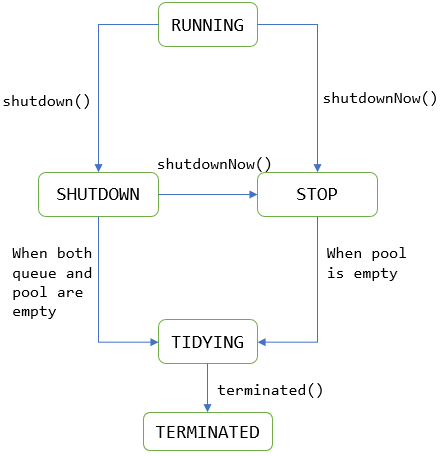
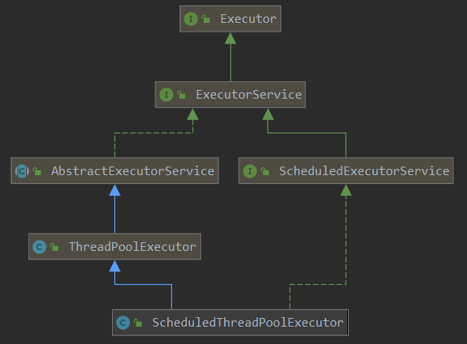

# 线程池

为什么使用线程池：
进程与线程

在``web``开发的过程中，服务器需要接受并处理请求，会为每一个请求都分配一个线程来进行处理。如果每次都**新创建**一个线程来处理这个请求，实现起来很简单，但是存在一个问题：
如果并发请求的数量非常多，但是每次线程处理这个请求的时间都非常短。这样就会频繁的创建和销毁线程，从而大大降低系统效率。可能出现服务器在为每个请求**创建新线程和销毁线程所花的时间和消耗的系统资源**要比**处理实际的用户请求所花费的时间和资源更多**

合理的利用线程池能带来很多的好处：
第一：**降低资源消耗**。通过重复利用已创建的线程降低线程创建和销毁造成的资源消耗。
第二：**提高响应速度**。当任务到达时，任务可以不需要的等到线程创建就能立即执行。

第三：**提高线程的可管理性**。线程是稀缺资源，如果无限制的创建，不仅会消耗系统资源，还会降低系统的稳定性，采用线程池池化的思想，使用线程池可以进行统一的分配，调优和监控。

线程与进程的区别：
总结：进程和线程都是一个时间段的描述，是CPU工作时间段的描述，不过描述的精细化程度不同。
 
CPU+RAM+各种资源（比如显卡，光驱，键盘，GPS, 等等外设）构成我们的电脑，但是电脑的运行，实际就是CPU和相关寄存器以及RAM之间的事情。一个最最基础的事实：CPU太快，太快，太快了，寄存器仅仅能够追的上他的脚步，RAM和别的挂在各总线上的设备完全是望其项背。那当多个任务要执行的时候怎么办呢？轮流着来?或者谁优先级高谁来？不管怎么样的策略，一句话就是在CPU看来就是轮流着来。一个必须知道的事实：执行一段程序代码，实现一个功能的过程，当得到CPU的时候，相关的资源必须也已经就位，就是显卡啊，GPS啊什么的必须就位，然后CPU开始执行。这里除了CPU以外所有的就构成了这个程序的执行环境，也就是我们所定义的程序上下文。当这个程序执行完了，或者分配给他的CPU执行时间用完了，那它就要被切换出去，等待下一次CPU的临幸。在被切换出去的最后一步工作就是保存程序上下文，因为这个是下次他被CPU临幸的运行环境，必须保存。串联起来的事实：前面讲过在CPU看来所有的任务都是一个一个的轮流执行的，具体的轮流方法就是：

先加载程序A的上下文，然后开始执行A，保存程序A的上下文，调入下一个要执行的程序B的程序上下文，然后开始执行B,保存程序B的上下文。。。。
========= 重要的东西出现了========进程和线程就是这样的背景出来的，
两个名词不过是对应的CPU时间段的描述，
进程就是包换上下文切换的程序执行时间总和 = CPU加载上下文+CPU执行+CPU保存上下文

线程是什么呢？进程的颗粒度太大，每次都要有上下的调入，保存，调出。如果我们把进程比喻为一个运行在电脑上的软件，那么一个软件的执行不可能是一条逻辑执行的，
必定有多个分支和多个程序段，就好比要实现程序A，实际分成 a，b，c等多个块组合而成。那么这里具体的执行就可能变成：
程序A得到CPU =》CPU加载上下文，开始执行程序A的a小段，然后执行A的b小段，然后再执行A的c小段，最后CPU保存A的上下文。这里a，b，c的执行是共享了A的上下文，CPU在执行的时候没有进行上下文切换的。这里的a，b，c就是线程，也就是说线程是共享了进程的上下文环境，的更为细小的CPU时间段。

## ``、``

1. 构造函数

    ```java
    public ThreadPoolExecutor(int corePoolSize,
                              int maximumPoolSize,
                              long keepAliveTime,
                              TimeUnit unit,
                              BlockingQueue<Runnable> workQueue,
                              ThreadFactory threadFactory,
                              RejectedExecutionHandler handler)
    ```

    + 说明：
        1. ``corePoolSize``：线程池核心线程数量。新建一个``ThreadPoolExecutor``对象后，**默认**的情况下，线程池中并没有任何线程。而是等待有任务到来时，才会创建新的线程去执行任务。

            + 如果运行的线程数量少于``corePoolSize``，那么来一个任务，都会创建一个新的线程去执行，**尽管此时有空闲的线程**。一直到线程数等于``corePoolSize``

            + 如果此时线程数等于``corePoolSize``，那么来了一个任务，如果此时有空闲的线程，那么直接空闲的线程执行该任务，如果没有空闲线程，那么会加入到阻塞队列中。直到有空闲的线程，那么会从这个阻塞队列中取出任务执行。

            + 如果此时阻塞队列已经满了，并且没有空闲的线程，即此时所有的线程都在执行任务。如果此时线程数还没有到达最大线程数，那么会新创建一个线程去执行任务。如果此时线程数已经到达了最大线程数，那么此时会执行拒绝策略，默认的执行拒绝策略是``AbortPolicy``，即直接抛出一个异常。

            + 注意：也即只有当核心线程全被处于工作状态，并且此阻塞队列已满，那么此时会尝试去创建新的线程来执行任务。但是尝试创建新的线程可能会不成功，因为此时是否能继续创建新的线程取决于 ``maximunPoolSize`` 的数值。

        2. ``maximumPoolSize``：线程池能维持的最大线程数。

        3. ``keepAliveTime``：当线程池的线程数量大于``corePoolSize``，且此时没有任务提交，线程处于空闲的状态。那么会等待``keepAliveTime``时间，随后超过核心线程的线程或被销毁

        4. ``unit``：时间单位。即保持线程存活的时间的单位。

        5. ``handler``：拒绝策略，如果此时阻塞队列满了，且没有空闲的线程，也无法创建新的线程，因为此时线程的总数已经达到了最大线程的数量，那么如果继续提交任务，那么会执行相应的拒绝策略。
            + 所有的拒绝策略都被封装成``RejectedExecutionHandler``类，自定义拒绝策略需要我们继承这个类并且``Override``这个类的``rejectedExecution()``方法
            + ``AbortPolicy``：直接抛出异常，这是默认策略。源码中``rejectedExecution()``方法是直接``throw RejectedExecutionException``异常。

                ```java
                public void rejectedExecution(Runnable r, ThreadPoolExecutor e) {
                    throw new RejectedExecutionException("Task " + r.toString() +
                                                            " rejected from " +
                                                            e.toString());
                    }
                }
                ```

            + ``CallerRunsPolicy``：用**调用者所在的线程执行任务**（注意这个调用者线程的含义，即在调用``execute()``方法的线程中），即若是在``main``线程中进行提交任务，即执行``pool.execute(task)``，那么就会用``main``线程来执行这个任务。

                ```java
                public void rejectedExecution(Runnable r, ThreadPoolExecutor e) {
                    if (!e.isShutdown()) {
                        r.run();  //用调用者所在的线程来执行任务。
                    }
                }
                ```

            + ``DiscardOldestPolicy``：丢弃阻塞队列的最靠前的任务，并且将**该任务在此提交到线程池**，注意是进行``execute()``方法，继续向线程池中尝试进行提交任务。

                ```java
                public void rejectedExecution(Runnable r, ThreadPoolExecutor e) {
                    if (!e.isShutdown()) {
                        e.getQueue().poll();
                        e.execute(r);   // 向线程池中提交任务。注意此时任务可能直接进入到阻塞队列中
                    }
                }

                ```

            + ``DiscardPolicy``：直接丢弃当前任务（源码中``rejectedExecution()``方法为空，即啥也没做）

                ```java
                public void rejectedExecution(Runnable r, ThreadPoolExecutor e) {

                }

                ```

            + 自定义处理策略，实现``RejectedExecutionHandler``，重写``rejectedExecution()``方法即可。

            + ***感觉所有的拒绝此策略方法都是由调用线程来执行的***。

        6. 阻塞队列
            + ``LinkedBlockingQueue``：基于链表实现的阻塞队列。在创建``LinkedBlockingQueue``对象时，如果没有指定容量大小，则默认为``Integer.MAX_VALUE``，从而是无界阻塞队列。当大量任务到来无法被处理，加入到这个阻塞队列中，会导致服务器内存彪升。**谨慎使用**。当创建``LinkedBlockingQueue``对象时，如果在构造函数中指定了容量的大小，那么就是一个有界队列。

            + ``ArrayBlockingQueue``：基于数组实现的阻塞队列，在创建``ArrayBlockingQueue``对象时必须要指定容量大小。即这是一个有界队列

            + ``SynchronousQueue``：同步移交队列，但本质上并不是一个队列，而是一个线程之间的移交的机制。要将一个任务放入到``SynchronousQueue``中，**必须要有其他的线程正在等待接受这个任务元素**。也就是说任务能存入到该队列的前提条件是必须已经有一个线程正在等待着从这个队列中拿任务了，也就是说，任务刚放进队列，即被等待的线程取出执行。

    + 4种常见的线程池解析

        ``Executors``提供了创建线程的各种方法
        + ``newCachedThreadPool()``

            ```java
            public static ExecutorService newCachedThreadPool() {
                return new ThreadPoolExecutor(0, Integer.MAX_VALUE,
                                      60L, TimeUnit.SECONDS,
                                      new SynchronousQueue<Runnable>());
            }
            ```

            注意：核心线程的数量为0，但是最大线程数量为``Integer.MAX_VALUE``。这就说明如果任务执行的时间过长，且任务提交的速度很快，那么来了一个任务就会创建一个新的线程来处理这个任务，因为``newCachedThreadPool``的阻塞队列是``synchronousQueue``，本质上不存放任何的任务，只是一个移交机制，所以只要来一个任务都会在不超过最大线程数的前提下创建一个线程来执行这个任务。由于设置的最大线程数量未``Integer.MAX_VALUE``，所以可能会**创建很多的线程**执行提交的任务，从而**导致线程数量太多**，发生``OOM``

        + ``newFixedThreadPool``

            ```java
                public static ExecutorService newFixedThreadPool(int nThreads) {
                    return new ThreadPoolExecutor(nThreads, nThreads,
                                      0L, TimeUnit.MILLISECONDS,
                                      new LinkedBlockingQueue<Runnable>());
            }
            ```

            注意：该线程池采用**无界阻塞队列**。传入的参数是核心线程池的数量。且构造函数中核心线程的数量与最大线程数量设置为相等。由于是无界阻塞队列，所以**可能并发任务太多**，并且都被存入到阻塞队列中，不会执行拒绝策略，所以也会发生``OOM``

2. 线程池状态

    1. ``RUNNING``：``Accept new tasks and process queued tasks``
    此时线程接受新提交的任务，并且也处理阻塞队列中的任务

    2. ``SHUTDOWN``： ``Don't accept new tasks, but process queued tasks``
    线程池处于关闭状态。不再接受新提交的任务，但仍然处理阻塞队列中已经保存的任务。在线程池处于``RUNNING``状态时，调用``shutdown()``方法会使该线程池处于该状态。``RUNNING -> SHUTDOWN,On invocation of shutdown(), perhaps implicitly in finalize()``

    3. ``STOP``：``Don't accept new tasks, don't process queued tasks,and interrupt in-progress tasks``。
    不接受新提交的任务，也不处理队列中的任务，会中断正在处理任务的线程。线程池处于``RUNNING``和``SHUTDOWN``状态时，调用``shutdownNow()``会使线程处于该状态。``(RUNNING or SHUTDOWN) -> STOP,On invocation of shutdownNow()``

    4. ``TIDYING``：``All tasks have terminated, workerCount is zero,the thread transitioning to state TIDYING,will run the terminated() hook method``
    所有的任务任务都终止，有效线程数为0。线程池进入该状态后会调用``terminated()``方法进入到``TERMINATED``状态

    5. ``TERMINATED``：``terminated() has completed``
    执行完``terminated()``方法后进入到该状态。

        

3. ``Executor``框架

    

    1. ``Executor``接口

        ```java

        public interface Executor {

            void execute(Runnable command);
        }
        ```

        仅仅有一个``execute(Runnable command)``抽象方法

    2. 向线程池提交任务， ``submit()``和``execute()``

        ```java

        /**
         * 注意：Future<?>是一个具体的类型，和Integer，String一样，都是特定的类型
         */
         // submit 函数参数的类型可以是 Runnable 类型或者是 Callable 类型，如果是 Runnable
         // 类型，那么会通过适配器模式将其转换成 Callable 类型，然后通过FutureTask将Callable
         // 类型进行封装成任务对象，然后调用 execute 函数执行该 FutureTask 类型的对象，因为 、
         // execute 函数的参数类型是 Runnable 类型的。所以 submit 函数本质上还是调用呢 execute
         // 函数
        public Future<?> submit(Runnable task) {
            if (task == null) throw new NullPointerException();
            //通过newTaskFor()方法将Runnable类型的转换成Callable类型
            RunnableFuture<Void> ftask = newTaskFor(task, null);
            execute(ftask);  // 即本质上还是调用execute()来提交Runnable任务
            return ftask;
        }

        public <T> Future<T> submit(Runnable task, T result) {
            if (task == null) throw new NullPointerException();
            RunnableFuture<T> ftask = newTaskFor(task, result);
            execute(ftask);
            return ftask;
        }

        protected <T> RunnableFuture<T> newTaskFor(Runnable runnable, T value) {
            return new FutureTask<T>(runnable, value);  // 参照Thread.md文件
        }

        public <T> Future<T> submit(Callable<T> task) {
            if (task == null) throw new NullPointerException();
            RunnableFuture<T> ftask = newTaskFor(task);
            execute(ftask);  // 本质上还是调用execute(ftask)方法。而execute()方法参数类型是Runnable接口
            return ftask;
        }
        ```

        总结：
        + ``submit()``方法有返回值，返回值类型为``Future<T>或者Future<?>类型``。而``execute()``方法没有返回值。``submit()``方法的内部实际调用了``execute()``方法。

        + ``execute()``方法是在``Executor``接口中定义的。在``ThreadPoolExecutor``类中实现。而``submit()``方法是在``ExecutorService``接口中定义的，在``AbstractExecutorService``中进行实现。而这几个类与接口的``UML``图如上所示。

        + ``submit()``方法有三个重载形式。可以直接传入一个``Callable``实例。也可以直接传入一个``Runnable``实例，也可以传入``Runnable task, T result``。
        不管是传入``Callable``实例还是``Runnable``实例，**都会在内部将其包装成FutureTask**，因为``FutureTask``类继承了``Runnable``接口，所以可以作为任务对象被执行，然后调用``execute()``方法，将该``FutureTask``提交给线程池。
