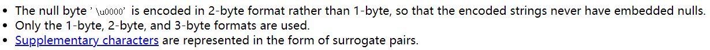

# 编码相关

## ``Java``中的编码

1. ``Java``源文件编码格式

    即``*.java``文件的编码格式，根据``IDE``的设置，可以为``GBK``，也可以为``UTF-8``

    ``javac.exe``在默认的情况下采用**操作系统默认的编码格式**来对``*.java``文件进行解码操作。中文操作系统默认为``GBK``。所以当``*.java``文件编码格式为``UTF-8``，而``javac.exe``用``GBK``进行解码，就会出现**不可映射字符的错误**

2. ``*.class``字节码文件编码方式

    无论``Java``源文件``*.java``采用什么格式进行编码，``Java``字节码文件``*.class``采用``modified UTF-8``来进行编码。这也是``Java``能**跨平台**使用的原因。因为所有的``*.class``的编码方式都是``modified UTF-8``。不与操作系统的类型有关。即不论是什么类型的操作系统，``Java``源文件``*.java``的编码格式可能各种各样，但是只要被编译成``*.class``文件，那么最终``*.class``文件的编码就是``modified UTF-8``

    + ``modified UTF-8``
        
        

    + **将字节码文件加载到``JVM``中，在``JVM``中，编码方式为``UTF-16``**，即字符类型是2个字节来存储。如果要存储非``BMP``字符，那么额外需要两个2个字节。

    + **总结1与2**
        + ``javac -encoding UTF8 HelloWorld.java``可以指定 **编译器解码``*.java``文件并将其编译成``*.class``文件** 的编码方式。如果没有指定这个参数，那么默认采用平台默认编码（注意与``file.encoding``区别）。中文``Windows``为``GBK``

        + ``java -Dfile.encoding=utf8 HelloWorld``可以在虚拟机初始化启动时设置``file.encoding``的值。并且``file.encoding``的值一旦被设置，便**不能动态修改**。
        这个值就是``getbytes()``和``InputStreamReader``在进行一些操作时如果没有指定编码时的所说的默认编码。

        + 当没有显示设置``-Dfile.encoding``参数时，那么此时``-Dfile.encoding``的默认值即为平台默认编码（中文操作系统为``GBK``），即此时虚拟机启动后，``file.encoding``的值即为平台默认值。

            ```java
            import java.io.*;
            public class GetFileEncoding {
                public static void main(String[] args) throws IOException {
                    System.out.println(System.getProperty("file.encoding"));
                }
            }

            ```

            **在CMD中执行操作和结果如下所示**:
            
            ``javac``由于没有指定``-encoding utf8``，那么将采用平台默认编码``GBK``来进行解码编译。

3. ``Unicode``编码

    1. ``Java``中字符或者是字符串是用``UTF-16``来编码的。即我们在创建一个字符类型变量时，可以直接通过``char noNor = '\u9999';``来进行赋值。即直接赋值字符的``UTF-16``编码的数值，是16进制数值。

    2. 对于非``BMP``平面的字符，不能够这样来进行赋值操作，因为``char``类型为两个字节，而非``BMP``平面的字符，``UTF-16``编码为4个字节。则需要用4个字节来存储。所以对于非``BMP``平面的字符，需要用``char[]``来存储。

        ```java
        public static void main(String[] args) throws IOException {
            char[] noNor = {'\uD801', '\uDC37'};
            System.out.println(noNor);
        } // 输出为 𐐷
        ```

    3. 具体的编码算法见``UTF-8 Wiki``。

    4. 本质上内部是以下来实现判断是否是非``BMP``平面的字符。以下为``Character``类的一个方法实现，该方法会判断该字符是否是非``BMP``平面的字符

        ```java
        /**
         * 根据索引来得到该字符的Unicode码
         */

        public static int codePointAt(char[] a, int index) {
            return codePointAtImpl(a, index, a.length);
        }

        static int codePointAtImpl(char[] a, int index, int limit) {
            char c1 = a[index];
            //如果是前导代理，那么在判断是否是后尾代理。
            if (isHighSurrogate(c1) && ++index < limit) {
                char c2 = a[index];
                if (isLowSurrogate(c2)) {
                    return toCodePoint(c1, c2);
                }
            }
            return c1;  // 如果即是前导代理也是后尾代理，那么返回相应的字符
            //否则，如果仅仅是前导代理，那么返回 ？
        }
        ```

4. ``getProperty()``
    该函数得到的是``JVM``初始化时的参数。

    ```java
    /**
     * 获取所有的properties。
     */
    public class Test {
        public static void main(String[] args) {
            Properties properties = System.getProperties();
            System.out.println(properties.size());
            for (Object o : properties.keySet()) {
                System.out.println("" + o + "=" + properties.get(o));
            }
        }
    }
    ```

5. ``defaultCharset``默认编码
    当没有指定默认编码时，会**根据``file.encoding``参数**来确定默认的编码。而``file.encoding``的值可以根据``System.getProperty("file.encoding")``来获取。即**API文档中的一些平台默认的编码其实指的是file.encoding**的值。由于在我们没有显示设置``file.encoding``的参数的时候，会默认采用平台默认的编码方式将其赋值给``file.encoding``，所以一般``file.encoding``与平台默认的编码方式相等，除非显示设置。

    ```java
    /**
     * Unfortunately, the file.encoding property has to be
     * specified as the JVM starts up; by the time your main
     * method is entered, the character encoding used by
     * String.getBytes() and the default constructors of
     * InputStreamReader and OutputStreamWriter has been permanently cached.
     */
    ```

    即``file.encoding``属性在虚拟机启动时便被永久确定。之后便不能够修改。

    ```java
    /**
     * Code such as System.setProperty(“file.encoding”, “UTF-8”) can
     * be used to change this property. However, the default encoding
     * can not be changed dynamically even this property can be changed.
     * So the conclusion is that the default encoding can’t be changed after JVM starts.
     */
    ```

    + ``String``类与编码相关的操作如下:

        ```java
        public byte[] getBytes() {
            return StringCoding.encode(value, 0, value.length);
        }

        static byte[] encode(char[] ca, int off, int len) {
            //可见，默认情况下会根据Charset类的defaultCharset()
            //方法来确定默认编码
            String csn = Charset.defaultCharset().name();
            try {
                // use charset name encode() variant which provides caching.
                return encode(csn, ca, off, len);
            } catch (UnsupportedEncodingException x) {
                warnUnsupportedCharset(csn);
            }
            try {
                return encode("ISO-8859-1", ca, off, len);
            } catch (UnsupportedEncodingException x) {
                // If this code is hit during VM initialization, MessageUtils is
                // the only way we will be able to get any kind of error message.
                MessageUtils.err("ISO-8859-1 charset not available: "
                                + x.toString());
                // If we can not find ISO-8859-1 (a required encoding) then things
                // are seriously wrong with the installation.
                System.exit(1);
                return null;
            }
        }

        public static Charset defaultCharset() {
            if (defaultCharset == null) {
                synchronized (Charset.class) {
                    // 可知，是通过file.encoding这个属性来得到默认编码的
                    // 而file.encoding是在虚拟机初始化启动时就传入的，
                    // 并且不支持动态修改（尽管可以通过System.setProperty("file.encoding","GBK")
                    // 方法进行修改，但没啥作用）
                    String csn = AccessController.doPrivileged(
                        new GetPropertyAction("file.encoding"));
                    Charset cs = lookup(csn);
                    if (cs != null)
                        defaultCharset = cs;
                    else
                        defaultCharset = forName("UTF-8");
                }
            }
            return defaultCharset;
        }
        ```

    + ``IO``流

        + ``InputStreamReader``

            ```java
            public InputStreamReader(InputStream in) {
                super(in);
                try {
                    sd = StreamDecoder.forInputStreamReader(in, this, (String)null);
                    // ## check lock object
                } catch (UnsupportedEncodingException e) {
                    // The default encoding should always be available
                    throw new Error(e);
                }
            }

            public static StreamDecoder forInputStreamReader(InputStream var0, Object var1, String var2) throws UnsupportedEncodingException {
                String var3 = var2;
                if (var2 == null) {

                    // 可见也是通过CharSet.defaultCharset()来获取默认编码
                    var3 = Charset.defaultCharset().name();
                }

                try {
                    if (Charset.isSupported(var3)) {
                        return new StreamDecoder(var0, var1, Charset.forName(var3));
                    }
                } catch (IllegalCharsetNameException var5) {
                }

                throw new UnsupportedEncodingException(var3);
            }
            ```
