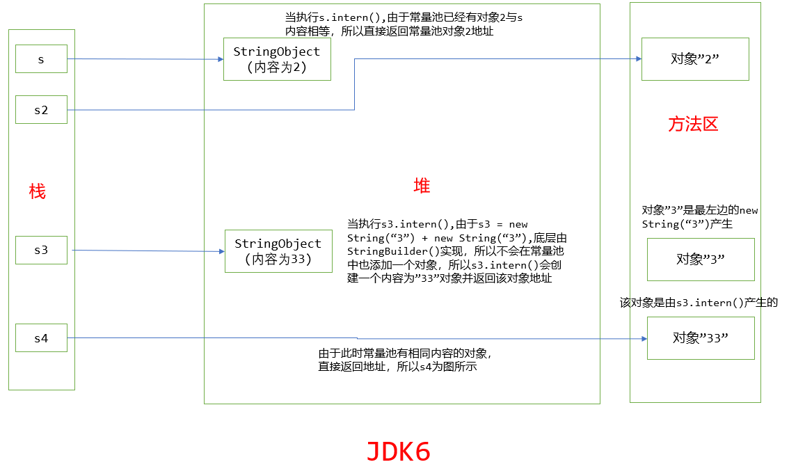
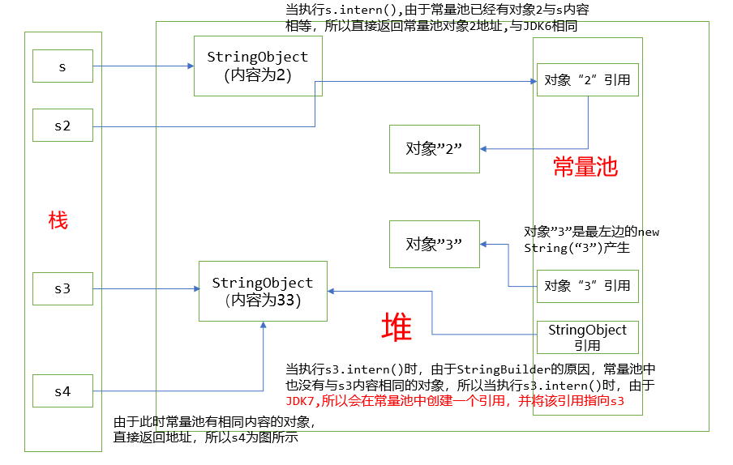

# 一些小的知识点

## 字面量，常量，变量

1. 说明如下

    ```java
    int a = 19;  // 19是一个字面量，a是一个变量

    // Mary是一个字符串字面量
    // 这一句代码的意思是将字面量Mary赋值给String类型的变量name
    String name = "Mary";

    // height由于被final修饰，所以是一个常量，100是一个字面量
    final int height = 100;

    // age是一个变量,24是一个字面量，即将字面量24赋值给变量age
    int age = 24

    /**
     * 综上分析：变量和常量都是一个引用，都可以作为左值。
     * 变量值可变，常量值一经赋值，便不可变，字面量是一个值。
     * 字面量不可以作为左值
     */

    ```

## 常量池

1. 全局字符串常量池（``String Pool``或者称之为``String Literal Pool``）

    **字符串常量池**的位置随``JDK``版本的不同而不同。在``JDK6``中，常量池的位置在**永久代**中，此时常量池中存放的是**对象**。在``JDK7``中，常量池的位置在堆中，此时，常量池存放的是**引用**，该引用指向的**对象**也是在堆中创建的，即**对象和对应的引用**都位于堆中。

    **全局常量池在每个VM实例中只有一份，被所有的类共享**。**字符串对象在解析的时候会去全局字符串常量池中查询是否有与将要创建的字符串对象的内容相等的对象**，如果有，那么直接返回全局字符串常量池中的那个对象，没有就根据实际情况肯定创建一个对象加入到常量池中，具体说明如下：

    如果采用``String name = new String("caobo")``，那么肯定会在堆中创建一个对象，并且将堆中的对象返回，即此时``name``指向的是堆中的对象。然后会去全局字符串常量池中查找是否有对象的内容是**caobo**，如果有，那么什么都不做。如果没有，那么会创建一个新的对象，该对象的内容为**caobo**，并且加入到常量池中。

    如果采用``String name = "caobo"``，那么会直接去全局字符串常量池查找是否有对象内容为**caobo**，如果有，那么直接返回这个全局字符串常量池中的对象，即此时``name``指向的是全局字符串常量池中的对象。如果没有，那么会创建一个新的对象，该对象的内容为**caobo**，然后将该对象返回，即``name``此时指向该对象。

    ```java
    public class TestString {
        public static void main(String[] args) {
            TestString testString = new TestString();
            testString.test();
        }

        public void test() {
            String s = new String("2");
            String s3 = s.intern();
            String s2 = "2";
            System.out.println(s == s2);
            System.out.println(s2 == s3); // 1.6和1.8版本均返回true

            //************************************//

            String s3 = new String("3") + new String("3");
            s3.intern();
            String s4 = "33";
            System.out.println(s3 == s4);
        }
    }

    /**
     * 1.JDK6结果：
     *   false
     *   false
     * 2.JDK7或者8中结果：
     *   false
     *   true
     */
    ```

    分析如下：
    + ``JDK6``
        

        + ``String s = new String("2");``通过``new String("字符串字面量");``来创建，会创建两个对象，一个在堆中，记为``StringObject``，一个在常量池中，记为``"2"``（因为此时常量池中并没有一个对象的内容为**2**），并且此时``s``指向的是``StringObject``，即堆中的那个对象
        + ``s.intern();``在常量池中找与``s``**内容相同**的字符串对象，此时上一步已经将``"2"``对象加入到常量池中了，且这个``"2"``对象的内容为**2**与``s``这个字符串对象的内容相同，所以该函数直接返回这个``"2"``对象的在常量池中的**内存地址，即一个字符串对象的引用**。

        + ``String s2 = "2";``使用**字符串字面量**创建对象，会先在常量池中寻找是否有一个对象的内容与这个字面量相等，如果有，那么直接返回常量池中这个对象的引用，如果没有，那么会在常量池中创建一个新的对象，并将地址返回。此时这里是有的，所以直接将常量池中的地址返回。

        + 因为``s``指向堆内存的``Object``，``s2``指向常量池的``"2"``，所以地址不相等，``System.out.println(s == s2);``返回``false``。

        + ---

        + ``String s3 = new String("3") + new String("3");``由于``+``有操作``String``对象，所以``+``的底部实现原理是通过``StringBuilder``来进行实现的。
            + 即先执行左边的``new String("3")``，在常量池和堆内存中都会创建一个对象``"3"``，右边的``new String(3)``会仅仅在堆中创建一个对象，因为常量池中已经有一个跟这个对象**内容**相等的对象了。

            + 会创建一个``StringBuilder``对象然后调用``append()``方法将这两个对象拼接然后调用``StringBUilder``对象的``toString()``方法``new String(value,0,count);``在堆中创建一个新的``String``对象返回给``s3``，这个对象的内容为**33**。**注意**：此处创建新的``String``对象**不会将这个对象添加到常量池中**，**因为不是通过字符串字面量来创建的**

            + 此时``s3``指向堆中的那个``StringObject``，内容为**33**。字符串常量池中的对象的内容为``3``，是执行最左边的那个``new String("3")``创建的。

            + ``s3.intern();``在常量池中寻找与``s3``变量**内容**相同的对象，没有发现内容为"33"对象，所以在常量池中创建一个内容为**33**对象``"33"``，返回该对象对象的地址。注意这是与``JDK7``不同的地方，``JDK7``会直接将``intern()``方法调用者的地址返回，即此时返回``s3``的地址。

            + ``String s4 = "33";``使用字符串字面量创建，在常量池寻找是否有相同内容的对象，发现有，返回对象``"33"``的地址。

            + ``System.out.println(s3 == s4);``从上面可以分析出，``s3``变量指向堆内存中的那个变量，``s4``变量指向的是常量池中的那个对象，所以返回``false``

        **总结**：
        1. 在用字符串字面量通过``String name = new String("caobo")``创建对象时，肯定是会在堆中创建一个对象，并且会检查字符串常量池中是否有对象**内容**与该字符串字面量相等的对象。如果没有，那么在常量池中创建一个新的对象，内容与该字符串字面量内容相同。如果有，那么就不创建。

        2. 在用字符串字面量通过``String name = "caobo"``来创建对象，那么会在常量池中检查有没有对象的内容与该字符串字面量相等，如果有，那么直接返回该对象，如果没有，那么会在常量池中创建一个新的对象，并返回。

        3. ``s3.intern()``会在常量池中检查是否有对象内容与``s3``字符串对象内容相等，如果有，那该函数的返回值就是这个对象的引用，**如果没有，那么会新创建一个对象**，并返回。

        4. **``JDK6``**中，对象是**直接创建在常量池中**的。并且**常量池位于方法区中**

    + ``JDK7``
        

        + ``String s = new String("2");``创建了两个对象，一个**在堆中**的``StringObject``对象，一个是**在堆中**的``"2"``对象（因为此时常量池已经移到了堆中），并在常量池中保存``"2"``对象的引用地址。此时``s``指向的是``StringObject``

        + ``s.intern();``在常量池中寻找与``s``字符串对象内容相同的对象（**本质上是根据常量池存放的引用去堆中寻找**），发现已经存在内容相同对象，返回对象``"2"``的引用地址。

        + ``String s2 = "2";``使用字面量创建，在常量池寻找是否有相同内容的对象，发现有，返回对象``"2"``的引用地址。

        + ``System.out.println(s == s2);``从上面可以分析出，``s``变量和``s2``变量地址指向的是不同的对象，所以返回``false``

        + ---

        + ``String s3 = new String("3") + new String("3");``创建了两个对象，一个在堆中的``StringObject``对象，对象内容为**33**，一个是在堆中的``"3"``对象，并在常量池中保存``"3"``对象的引用地址。创建过程与``JDK6``中的相似

        + ``s3.intern();``在常量池中寻找与s3变量内容相同的对象，发现没有，将``s3``对应的``StringObject``对象的地址保存到常量池中，返回``StringObject``对象的地址。**即与``JDK6``的区别是当常量池中没有，会将``intern()``方法的调用者对象的引用保存到常量池中，而不是重新创建。**

        + ``String s4 = "33";``使用字面量创建，在常量池寻找是否有相同内容的对象，发现有，返回其地址，也就是``StringObject``对象的引用地址。如果没有，那么新创建一个对象。
        + ``System.out.println(s3 == s4);``从上面可以分析出，``s3``变量和``s4``变量地址指向的是相同的对象，即``StringObject``所以返回``true``。

        **总结**：
        1. 相比较于``JDK6``，``JDK7``**常量池在堆中，并且常量池中存放的是常量池对象的引用，而不是真正的对象**。而``JDK6``常量池是在方法区中，并且常量池中保存的就是实际的对象。

        2. 不管是在``JDK6``还是``JDK7``，通过``String name = new String("caobo");``创建都会在堆中创建一个对象。并且如果此时常量池没有这个对象(``JDK6``)（或者该对象引用(``JDK7``)），那么此时会在常量池中新创建一个对象。

        3. 不管是在``JDK6``还是``JDK7``，通过``String name = "caobo";``创建对象，都会在常量池中寻找是否有这个对象（内容相等）。如果有，直接返回，没有，那么在常量池中新创建对象，并且直接返回。

        4. **主要的区别是intern()**函数
            + 相同点：不管是在``JDK6``还是``JDK7``，如果调用``s.intern()``，会去常量池中寻找是否有对象内容与这个``s``的内容相等，如果有，直接返回

            + 不同点：在``JDK6``中，如果调用``s.intern()``，常量池中没有对象内容与这个``s``的内容相等，那么会在常量池中新创建一个对象，该对象的**内容**与``s``内容相等，并返回。而``JDK7``，如果没有这个对象，那么会将``s``的引用加入到常量池中，即不会重新新创建一个对象。而是复用字符串对象``s``。

    + 测试

        ```java
        public class TestIntern {
            public static void main(String[] args) {
                String s = new String("2");
                String s2 = "2";
                s.intern();
                System.out.println(s == s2);

                String s3 = new String("3") + new String("3");
                String s4 = "33";
                s3.intern();
                System.out.println(s3 == s4);
            }
        }

        /**
         * 上述代码在JDK6和7中均返回：
         * false
         * false
         * 分析原因：
         *     由于先执行String s4 = "33",但此时常量池中还没有"33"，所以
         *     会在常量池新建一个"33"对象。并将结果返回。而后执行s3.intern()
         *     发现已经常量池已经有了与s内容相等的对象，那么什么都不做，直接将
         *     常量池对象返回。所以此时s3指向堆，s4指向常量池，所以都会返回false
         */

        ```

2. ``class``文件常量池（``class constant pool``）

    即是字节码文件（``*.class``文件）中的一部分，``class``常量池是在编译的时候是每个``*.class``文件都有的，每一个类都有一个``class constant pool``。我们都知道，``class``文件中除了包含类的版本、字段、方法、接口等描述信息外，还有一项信息就是常量池(``constant pool table``)，用于存放编译器生成的各种字面量(``Literal``)和符号引用(``Symbolic References``)。注意只有**常量**（``final``修饰）和**文本字符串**被被放在``constant pool``字段中。一般的变量的右值**字面量不会被加入**

    + 符号引用
        + **类和接口的全限定名**
            全限定名包括包名和类名。注意每个类如果没有显示指定继承自哪个类，那么会默认继承自``Object``类。即也会将其父类的全限定名记录在``constant pool``中

        + **字段的名称和类型描述符**
            会将该类中定义的所有的**成员变量**（类变量和实例变量）的名字，**数据类型**记录下来。并不会记录访问权限和``static``,``final``等修饰符（在别的地方记录）

            // TODO 父类继承过来的呢？？会记录吗

        + **方法的名称和返回值类型**
            + 注意可能会有``<init>``  // TODO 难道只有非静态方法会记录名称和返回值？

3. **运行时常量池**（``runtime constant pool``）

    当``Java``文件被编译成``*.class``文件后，会生成一个``class constant pool``。注意``runtime constant pool``与``class constant pool``的区别。

    ``JVM``在执行某一个类时，会进行**加载**，**连接**，**初始化**。而连接部分又细分为**验证**，**准备**，**解析**三部分。当将类对应的字节码文件加载到内存后，``JVM``会将``class constant pool``中的内容放到**运行时常量池**，并且**运行时常量池也是每一个类都是只有一个**。由于``class constant pool``存放的是符号引用，即不是对象的实例的真正地址，所以经过解析阶段之后，会将符号引用转换成直接引用，**解析的过程会去查询全局字符串池**，从而使**某个字符串对象**全局只有一份。

4. ``String``中的 ``+``

    1. 如果``+``所操作的部分**含有**``String``对象（通过``new String("caobo")``产生或者``String name = "caobo"``产生，且没有用``final``修饰），或者有其他的基本数据类型**变量**，则底层是使用``StringBuilder``实现的拼接的

        ```java

        ```

        ```java

        public void test(){
            String ab = "ab";
            String cd = "cd";
            String both = ab + cd;

            /*
            以下代码也是会创建StringBUilder
            */

            /*
            Code 1：
            {
                String ab = "ab";
                String both = ab + "cd"; // 仅仅一个String对象，一个字符串字面量
            }
            */

            /*
            Code 2：
            {
                //注意本质上产生了几个对象。应该为4个。
                //左边的new String 产生2个对象，一个在常量池中，一个在堆中
                //右边的也会产生2个，一个在常量池，一个在堆中，然后StringBuilder调用
                //append()方法将其拼接，调用toString()返回一个String给both,both内容为abcd
                //注意不会在常量池中有内容为abcd对象，因为不是通过字符串字面量创建
                String both = new String("ab") + new String("cd");
            }


                /***************************字节码如下********************************/

                {
                    public void test();
                    Code:
                    0: new           #8                  // class java/lang/StringBuilder
                    3: dup
                    4: invokespecial #9                  // Method java/lang/StringBuilder."<init>":()V
                    7: new           #10                 // class java/lang/String
                    10: dup
                    11: ldc           #11                 // String ab
                    13: invokespecial #12                 // Method java/lang/String."<init>":(Ljava/lang/String;)V
                    16: invokevirtual #13                 // Method java/lang/StringBuilder.append:(Ljava/lang/String;)Ljava/lang/StringBuilder;
                    19: new           #10                 // class java/lang/String
                    22: dup
                    23: ldc           #14                 // String cd
                    25: invokespecial #12                 // Method java/lang/String."<init>":(Ljava/lang/String;)V
                    28: invokevirtual #13                 // Method java/lang/StringBuilder.append:(Ljava/lang/String;)Ljava/lang/StringBuilder;
                    31: invokevirtual #15                 // Method java/lang/StringBuilder.toString:()Ljava/lang/String;
                    34: astore_1
                    35: return
                }
                /***String both = new String("ab") + new String("cd")的反编译字节码***/
        }


        //反编译代码如下
        public test() { //()V
            L1 {
                ldc "ab" (java.lang.String)
                astore1
            }
            L2 {
                ldc "cd" (java.lang.String)
                astore2
            }
            L3 {
                //新建一个StringBuilder对象
                new java/lang/StringBuilder
                dup
                //调用StringBuilder的构造器函数。此时调用的是空参构造器
                invokespecial java/lang/StringBuilder.<init>()V
                //加载"ab"
                aload1
                //将"ab"作为形参调用StringBuilder的append()方法
                invokevirtual java/lang/StringBuilder.append(Ljava/lang/String;)Ljava/lang/StringBuilder;
                //再将"cd"加载
                aload2
                //将"cd"作为形参再次调用StringBuilder的append()方法
                invokevirtual java/lang/StringBuilder.append(Ljava/lang/String;)Ljava/lang/StringBuilder;
                //调用StringBuilder的toString方法，返回一个String类。注意：不会加入到常量池中。
                invokevirtual java/lang/StringBuilder.toString()Ljava/lang/String;
                astore3
            }
            L4 {
                return
            }
        }
        /**
         * 所以本质上是：String both = new StringBuilder().append(ab).append(cd).toString();
         */

        ```

    2. ``JDK1.8``下，如果相加的参数只有**字面量（字符串字面量或者数值字面量）**或者**常量**（``final``修饰，如：``final String name = "caobo"``），那么直接拼接，不会用``StringBuilder``

        ```java

        //TODO 当含有基本类型变量，还是会用StringBuilder啊？？？
        public void test(){
            // 注意字符串常量池中有内容为caoboabcd的对象
            // 但是没有内容为caobo 和 abcd的对象
            String name = "caobo" + "abcd";
        }
        //反编译代码如下：
        public test() { //()V
            L1 {
                ldc "caoboabcd" (java.lang.String)
                astore1
            }
            L2 {
                return
            }
        }
        ```

        ```java
        public void test(){
            String cd = "cd";
            int a = 8;
            final int c = 9;
            //会在堆中创建一个String对象，而常量池中没有
            String both = cd + a + c + "name";
        }

        //反编译代码如下
        public void test();
            Code:
            0: ldc           #8                  // String cd
            2: astore_1
            3: bipush        8
            5: istore_2
            6: new           #9                  // class java/lang/StringBuilder
            9: dup
            10: invokespecial #10                 // Method java/lang/StringBuilder."<init>":()V
            13: aload_1
            14: invokevirtual #11                 // Method java/lang/StringBuilder.append:(Ljava/lang/String;)Ljava/lang/StringBuilder;
            17: iload_2
            18: invokevirtual #12                 // Method java/lang/StringBuilder.append:(I)Ljava/lang/StringBuilder;
            21: bipush        9
            23: invokevirtual #12                 // Method java/lang/StringBuilder.append:(I)Ljava/lang/StringBuilder;
            26: ldc           #13                 // String name
            28: invokevirtual #11                 // Method java/lang/StringBuilder.append:(Ljava/lang/String;)Ljava/lang/StringBuilder;
            31: invokevirtual #14                 // Method java/lang/StringBuilder.toString:()Ljava/lang/String;
            34: astore        4
            36: return
        ```

    3. 如果使用字面量拼接的话，``java``常量池里是不会保存拼接的参数的（即常量池中不会产生内容为参数的对象），而是直接编译成拼接后的字符串保存

        ```java
        /**
         * 1.代码在JDK6中为false，在JDK7中为true。因为不会在常量池中保存拼接
         *  字符串的对象，所以此时常量池仅仅存在"aabb"的对象，而不会存在"aa"或者
         *  "bb"对象。
         * 2.由于不会创建上述说的两个对象，那么str2.intern()方法会根据不同的JDK来执行
         *   不同的逻辑策略。即在常量池不存在与str2内容相同的对象时，是新创建一个对象，
         *   还是复用原对象。
         * 3.如果时新创建（JDK6），那么返回false。如果复用str2（JDK7或者8），那么返回true
         */
        public class AppendTest {
            public static void main(String[] args) {
                String str1 = new String("aa"+"bb");
                // System.out.println(str1 == str1.intern());  //都会返回false。
                // 成功添加了，所以返回的是常量池中的"aabb"对象
                String str2 = new StringBuilder("a").append("a").toString();
                System.out.println(str2==str2.intern());
            }
        }
        ```

## 一个小知识

这里也是需要强调一点：永生代（``Perm Gen``）只是``Sun JDK``的一个实现细节而已，``Java``语言规范和``Java``虚拟机规范都没有规定必须有``Permanent Generation``这么一块空间，甚至没规定要用什么``GC``算法——不用分代式``GC``算法哪儿来的“永生代”?
``HotSpot``的``PermGen``是用来实现``Java``虚拟机规范中的“方法区”（``method area``）的。如果使用“方法区”这个术语，在讨论概念中的``JVM``时就安全得多——大家都必须实现出这个表象。
